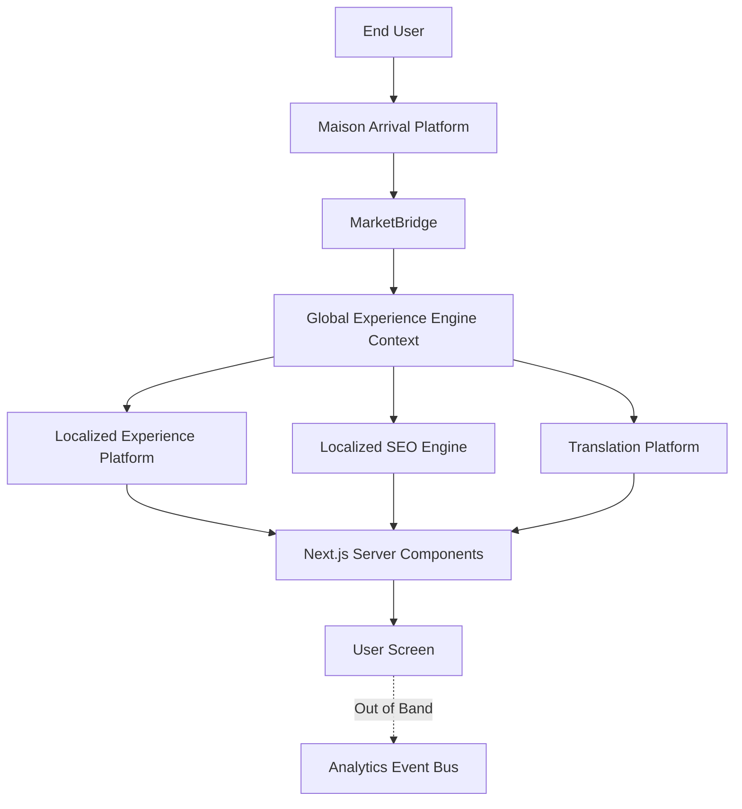

# ARCHITECTURE STATE REPORT

# 1. Executive Summary

Tezhhomayaa is a next-generation luxury fashion platform engineered as a highly bespoke, headless Enterprise Content Management System (CMS) paired with a high-performance storefront. It is designed to blur the lines between a high-fashion editorial magazine and a transactional shopping experience. 

**Current Development Stage:** The platform is in a transitional phase. It is migrating from rapid prototyping (JSON files) and MVP structures to a strict, enterprise-grade Domain-Driven Design (DDD) architecture. While advanced foundational domains (like the Global Experience Engine and Localized Experience Platform) are fully modeled and functionally robust, their underlying persistence layers are largely using in-memory stubs or file-based storage.

**Overall Architecture:** Built on Next.js 16 (App Router), the system follows a deeply layered architecture: Presentation -> Application Layer -> Commerce & Experience Engines -> Transaction Layer -> Persistence Layer.

**High-Level Design Philosophy:** 
- **Single Source of Truth:** Business logic is never duplicated.
- **Server First:** Sensitive operations happen exclusively on the server.
- **Modular & Composable:** Bounded contexts (e.g., Pricing, SEO, Translations) operate independently.
- **AI Friendly:** Architected with strict boundaries and well-typed interfaces to allow autonomous AI agents to extend the platform safely.

---

# 2. Technology Stack

**Frontend:** Next.js 16 (React 19), Framer Motion (v12) for luxury animations, inline styles / global CSS.
**Backend:** Next.js API Routes, Server Actions, Pure TypeScript Domain Services.
**Database:** Currently a hybrid. Legacy/CMS systems use file-based JSON storage (`lib/*.json`). New domains rely on Repository interfaces backed by `InMemory` stubs, with initial Firestore implementations (`FirestoreCampaignRepository`, `FirestoreContentItemRepository`) present.
**Authentication:** Highly rudimentary Admin authentication using `localStorage` (`tz_admin_user`). Preview environments are secured via robust JWT payloads in cookies.
**Hosting/Deployment:** Vercel (target).
**Media:** Cloudinary for image/video hosting and optimization.
**Libraries:** Tiptap Engine (Rich Text).

---

# 3. Folder Architecture

The project structure strictly separates UI from domain logic:

- **`app/`**: Next.js App Router core. Contains storefront routes (`/`, `/[...slug]`), and the secure Admin dashboard routes (`/admin`).
- **`components/`**: Modular React components, highly categorized by domain (`admin/`, `ecommerce/`, `layout/`, `lep/`, `preview/`, `sections/`, `ui/`, `arrival/`, etc.).
- **`lib/`**: The central nervous system. This directory is strictly divided into Bounded Contexts (domains) containing core business logic, services, resolvers, and repositories.
- **`hooks/`**: Custom React hooks.
- **`docs/`**: Permanent knowledge base and project documentation blueprints (e.g., `SYSTEM_ARCHITECTURE.md`).
- **`public/`**: Static assets, brand fonts, and placeholder images.
- **`scripts/`**: Build and automation scripts.

---

# 4. Domain Architecture

The platform's business logic is divided into strictly bounded contexts within the `lib/` directory.

### Maison Arrival Platform (MAP)
- **Purpose:** Handles the initial user interaction to select their geographic and linguistic preferences.
- **Dependencies:** Interacts with the `MarketBridge`.

### MarketBridge
- **Purpose:** The exclusive decoupled translator connecting the frontend MAP to the backend Global Experience Engine (GEE).
- **Responsibilities:** Takes raw Country/Language inputs and resolves them into a canonical Market ID (e.g., `in-en`) without crashing or throwing errors.

### Global Experience Engine (GEE)
- **Purpose:** The master truth for internationalization and market context.
- **Responsibilities:** Manages the `GlobalExperienceRegistry`, `MarketRegistry`, and provides robust Formatters (Currency, Date, Number, Time) and Services (TimezoneService, LocaleService).
- **Public APIs:** `GlobalExperienceRegistry`, Formatters, Resolvers.

### Localized Experience Platform (LEP)
- **Purpose:** Orchestrates localized, personalized content delivery.
- **Responsibilities:** Resolves the best content variant for a given slug based on the active Market and RuntimeContext.
- **Components:** `ContentService`, `ContentResolver`, `FirestoreContentItemRepository`.

### Campaign Management Engine
- **Purpose:** A sub-domain of LEP responsible for scheduling and targeting content.
- **Responsibilities:** Maps content variants to specific markets, regions, and date ranges (ValidFrom/ValidUntil).
- **Components:** `CampaignService`, `FirestoreCampaignRepository`.

### Localized SEO Engine
- **Purpose:** Manages highly specific, localized SEO metadata.
- **Responsibilities:** Executes a "Deep Merge" hierarchy (Global Default -> Region -> Market) to ensure maximum SEO coverage without redundant data entry.
- **Components:** `SeoService`, `SeoResolver`, `InMemorySeoRepository`.

### Translation Management Platform
- **Purpose:** Manages string dictionaries across the platform.
- **Responsibilities:** Resolves namespaces (e.g., "homepage", "checkout") based on the active Market and Language, with intelligent fallbacks to English. Validates placeholder interpolation.
- **Components:** `TranslationService`, `TranslationResolver`, `InMemoryTranslationRepository`.

### Experience Preview Platform
- **Purpose:** Allows administrators to securely view Draft, Scheduled, or Archived content without affecting production.
- **Responsibilities:** Parses JWT cookies to build a `PreviewRuntimeContext` or defaults to `ProductionRuntimeContext`. These contexts are injected into all resolvers (LEP, SEO, Translations) to alter resolution logic safely.
- **Components:** `PreviewService`, `RuntimeContextBuilder`.

### Experience Analytics Platform
- **Purpose:** A non-blocking, out-of-band telemetry system.
- **Responsibilities:** Captures events (PageView, SectionView, CampaignView) and fans them out to raw storage and aggregation repositories without degrading page performance.
- **Components:** `AnalyticsService`, `InMemoryEventBus`, `InMemoryAnalyticsRepository`, `InMemoryAggregationRepository`.

### Experience Lifecycle & Publishing Platform
- **Purpose:** Manages the strict state machine of content publishing (Draft -> In_Review -> Published).
- **Responsibilities:** Implements Optimistic Locking to prevent concurrent overwrite errors, logs audit trails, and publishes domain events when content goes live or is rolled back.
- **Components:** `PublishingService`, `InMemoryLifecycleEventBus`, `InMemoryLifecycleRepository`.

### Market Registry
- **Purpose:** A statically typed database (`MARKETS` array) in `lib/global-experience/MarketRegistry.ts` defining every supported country, currency, locale, timezone, and tax profile.

### Section Registry
- **Purpose:** (Partially implemented) Organizes individual UI blocks for the CMS and Analytics tracking.

### RuntimeContext
- **Purpose:** A strategy pattern object (`ProductionRuntimeContext` vs `PreviewRuntimeContext`) passed deep into resolvers to dictate whether Draft/Scheduled content is allowed to be served.

---

# 5. Runtime Flow

Exactly what happens when a visitor opens the homepage:

1. **Request:** The user navigates to `/`.
2. **Context Building:** `RuntimeContextBuilder` checks for a secure `tezhhomayaa-preview` JWT cookie. It instantiates either a `PreviewRuntimeContext` or `ProductionRuntimeContext`.
3. **Market Detection (MAP):** The system reads user cookies or headers to determine their raw Region/Country/Language.
4. **Market Resolution:** `MarketBridge` transforms raw inputs into a canonical Market ID (e.g., `in-en`), validating against the `GlobalExperienceRegistry`.
5. **Experience / Campaign Resolution (LEP):** `ContentService` queries the repository for the requested page slug. `ContentResolver` filters variants based on the active Market ID and `RuntimeContext` (checking `validFrom`/`validUntil` dates).
6. **SEO Resolution:** `SeoService` performs a deep-merge of global, regional, and market-specific SEO metadata for the resolved route.
7. **Translation:** Components invoke `TranslationService.resolveNamespace()` to pull the exact localized strings for the active Language, falling back to English if necessary.
8. **Rendering:** React Server Components (RSC) construct the HTML payload, injecting inline styles and Framer Motion primitives.
9. **Analytics:** Once rendered, out-of-band events are dispatched to the `InMemoryEventBus` (e.g., `PAGE_VIEW`), persisting metrics asynchronously without blocking the user.

---

# 6. Admin Platform

**Current State:** Highly Placeholder / MVP.
- **Admin Routes:** `/admin` and `/admin/(protected)`.
- **Authentication:** Extremely basic. The `AdminLogin` component (`app/admin/page.tsx`) checks a hardcoded `ADMIN_USERS` object and writes a `tz_admin_user` object to unencrypted browser `localStorage`.
- **Capabilities:** Allows access to the `CanvasEngine` and `Lookbook` CMS editors built during rapid prototyping.
- **Missing Capabilities:** Robust JWT session management, RBAC (Role-Based Access Control), and actual management dashboards for the newly modeled domains (Campaigns, SEO, Translations, Analytics, Lifecycle, Markets).

---

# 7. Current Features

**Completed:**
- Next.js 16 App Router scaffolding.
- Visual Experience Platform (VXP) Core / Canvas Engine.
- Global Experience Engine (GEE) core registries and formatters.
- MarketBridge and RuntimeContext strategy patterns.
- Cloudinary Media Upload integration.

**Partially Completed:**
- **LEP / Campaigns:** Business logic, services, and resolvers are fully typed and implemented. Relies on initial Firestore implementation stubs.
- **SEO / Translations / Lifecycle / Analytics:** Domain models, interfaces, resolvers, and services are 100% complete and robust. However, they are currently backed by `InMemory` repositories and event buses.

**Placeholder:**
- Admin Platform Authentication (Local Storage).
- JSON File-Based Database for legacy products/collections.

**Future Ready:**
- The strict adherence to the Repository pattern means the platform is entirely ready to swap `InMemory` stubs for real Postgres/Firestore drivers without changing a single line of business logic.

---

# 8. Architecture Decisions

1. **Domain-Driven Design (DDD):** Strict separation of concerns into Bounded Contexts. The Pricing Engine knows nothing of the SEO Engine.
2. **Repository Pattern:** All data access is abstracted behind interfaces (e.g., `ISeoRepository`), ensuring the core logic is entirely database-agnostic.
3. **Event Bus Pattern:** Used in Analytics and Lifecycle domains to decouple side-effects. For example, publishing a package emits an event rather than hard-coupling to a cache invalidation script.
4. **RuntimeContext Injection:** Passing a `RuntimeContext` object down the stack allows the platform to elegantly switch between Production and Preview modes without writing `if (isPreview)` checks in every component.
5. **Deep Merging (Hierarchical Resolution):** Used in SEO and Translations to allow Global defaults to be selectively overridden by Regional or Market-specific entries, reducing data entry duplication.
6. **Optimistic Locking:** Implemented in the Lifecycle domain using `versionNumber` to prevent concurrent administrators from overwriting each other's work.

---

# 9. Data Flow

---

# 10. Event Flow

The platform utilizes isolated event buses for cross-domain communication:

**Lifecycle Domain Events:**
- `PACKAGE_SUBMITTED_FOR_REVIEW`: Emitted when content enters the approval queue.
- `PACKAGE_PUBLISHED`: Emitted when content goes live. Consumed by external systems (future) to invalidate Edge Caches or rebuild search indexes.
- `PACKAGE_ROLLED_BACK`: Emitted when a package reverts to a previous version.

**Analytics Domain Events:**
- `PAGE_VIEW`, `SECTION_VIEW`, `CAMPAIGN_VIEW`, `PREVIEW_VIEW`. These are ingested by the `AnalyticsService` and fanned out to raw storage and materialized aggregation tables asynchronously.

---

# 11. Database / Persistence

**Current Storage Strategy:**
The persistence layer is highly fragmented due to the transitional state of the codebase.
1. **Legacy CMS:** Uses local `.json` files (e.g., `products.json`, `homepage.json`). Not viable for serverless production.
2. **New Domains:** Implement strict interfaces (`IRepository`). Currently, most of these (SEO, Translations, Analytics, Lifecycle) resolve to `InMemory` classes.
3. **LEP Domain:** Partially implemented using `FirestoreCampaignRepository`.

**Future Database Abstraction:**
The architecture perfectly supports a unified migration to a robust relational database (like PostgreSQL via Prisma/Firebase Data Connect) or NoSQL (Firestore). Because of the Repository pattern, replacing `InMemorySeoRepository` with `PostgresSeoRepository` will require zero changes to `SeoService` or `SeoResolver`.

---

# 12. Security

- **Authentication / Authorization:** Currently a critical technical debt. Admin uses a hardcoded `localStorage` string.
- **Preview Security:** Highly secure. Relies on signed JWT tokens stored in HttpOnly cookies, validated by `PreviewService.validateToken()`. Tampered cookies instantly revert the user to `ProductionRuntimeContext`.
- **Publishing Security:** Audit logs and Optimistic Locking ensure complete traceability of who changed what, and prevent concurrent overwrites.

---

# 13. Performance

- **Dynamic Rendering vs Static:** Next.js App Router heavily leans into Server-Side Rendering (SSR) and React Server Components (RSC) to minimize JavaScript sent to the client.
- **Caching:** Outlined in architecture, but currently unimplemented in the Domain Services (e.g., `ContentService` has commented-out cache logic).
- **Out-of-band Analytics:** `InMemoryEventBus` ensures that tracking telemetry never blocks the critical rendering path.
- **Media Optimization:** Deep integration with Cloudinary for AVIF/WebP conversion, paired with Base64 blur placeholders for instant perceived load times.

---

# 14. Completed Chapters

*(Extrapolated from PROJECT_MASTER.md and codebase state)*

- **Phase 1 (Foundations):** Next.js 16 scaffolding and App Router setup. (Completed)
- **Phase 2A-E (Prototyping):** JSON-based data layer, basic Admin Dashboard, Visual Experience Platform (VXP) Core, Cloudinary Integration, Lookbook CMS. (Completed)
- **Phase 3 (Aesthetics):** Global styling, motion engine, and luxury typography integration. (Completed)
- **Phase 4 (Enterprise Modeling - Current):** Transitioning to strict Domain-Driven Design. Implementation of GEE, LEP, MarketBridge, and foundational Domain Services. (Partially Completed - Logic modeled, DB pending).

---

# 15. Technical Debt

1. **Admin Security:** Immediate overhaul required for `/admin` authentication. Transition to secure HttpOnly cookies, JWT sessions, and RBAC.
2. **In-Memory Repositories:** SEO, Translations, Analytics, and Lifecycle domains will reset their data upon every server restart. They must be migrated to a persistent database.
3. **JSON File Database:** Legacy JSON files will not persist edits across Vercel deployments.
4. **Missing Caching Layer:** Enterprise scaling requires Redis (or similar) integration into the Domain Services to prevent DB hammering on every request.
5. **Missing UI:** The beautifully modeled Domain Services (SEO, Lifecycle, Translations) currently lack Admin Dashboard UI to actually manage them.

---

# 16. Future Roadmap

*(Based strictly on existing architecture)*

1. **Persistence Unification:** Implement concrete Postgres/Firestore repositories for all `IRepository` interfaces.
2. **Admin UI Expansion:** Build React interfaces in `/admin` to hook into `SeoService`, `TranslationService`, and `PublishingService`.
3. **Caching Layer:** Implement a centralized `CacheService` (Redis) and inject it into the Domain Services.
4. **Authentication Overhaul:** Implement robust NextAuth or Firebase Auth for the Admin platform.
5. **Notification Engine:** Consume the existing `LifecycleEventBus` to send emails/Slack alerts when a `PACKAGE_SUBMITTED_FOR_REVIEW` event fires.

---

# 17. Architecture Evaluation

| Category | Score | Justification |
| :--- | :--- | :--- |
| **Scalability** | 6 / 10 | The domain logic is endlessly scalable, but the current reliance on `InMemory` and `.json` databases bottlenecks production deployment. |
| **Maintainability** | 9 / 10 | Strict Domain-Driven Design. Highly isolated bounded contexts mean developers can work on SEO without touching the Pricing engine. |
| **Extensibility** | 10 / 10 | The Repository and Strategy (`RuntimeContext`) patterns make adding new databases or preview modes trivial. |
| **Separation of Concerns** | 10 / 10 | Exemplary separation. UI never touches databases; services never touch React. |
| **Enterprise Readiness** | 5 / 10 | The blueprint is enterprise, but the execution lacks real security, caching, and persistent databases. |

---

# 18. AI Handover Summary

**To the next AI Architect:**
Tezhhomayaa is a beautifully architected, strictly DDD-compliant Next.js platform. The core engines (GEE, LEP, SEO, Translations, Analytics, Lifecycle) are 100% modeled with robust TypeScript services, resolvers, and repository interfaces.

**Your immediate constraints:**
- **Do not rewrite business logic:** The domain models are pristine. 
- **Focus on Persistence:** Your primary goal should be swapping the `InMemory*` repositories for actual database drivers (e.g., Postgres, Firebase).
- **Focus on Security:** The Admin platform (`app/admin/page.tsx`) uses a highly insecure `localStorage` strategy. Overhaul this immediately.
- **Build the UI:** The backend services for SEO, Translations, and Lifecycle are complete, but there are no Admin UI screens to manage them yet. 

Continue to respect the strict decoupling: Frontend calls Application Layer -> Application Layer calls Domain Services -> Domain Services call Repositories. Do not bypass this flow.
