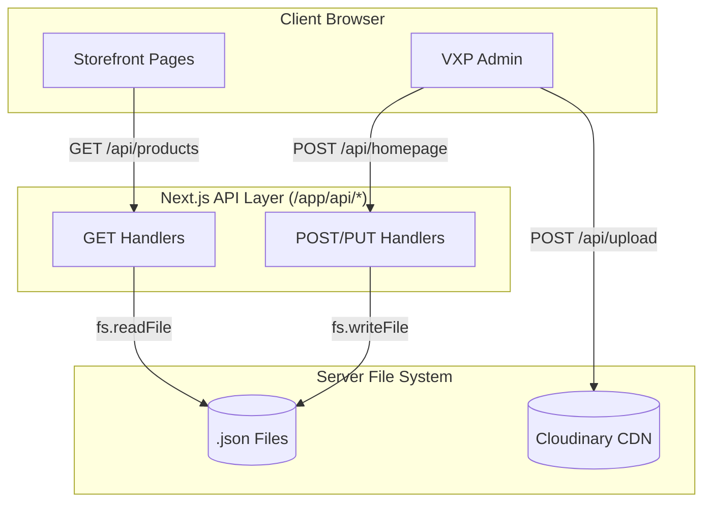

# API Reference

## Vision

The Tezhhomayaa API layer is designed to act as a strict mediator between the React Frontend (Storefront and VXP Admin) and the File-Based Database (`/lib/*.json`). It prevents the client from ever reading or mutating the filesystem directly, establishing a clear contract for future migration to PostgreSQL.

## API Philosophy

- **Simplicity**: Next.js App Router handlers (`app/api/*/route.ts`).
- **JSON Standard**: All endpoints consume and produce `application/json` (except media uploads).
- **Graceful Degradation**: Endpoints return empty arrays rather than crashing the storefront if a JSON file is missing.
- **Stateless**: The API does not maintain sessions; it strictly executes file operations.

==================================================

## Architecture



==================================================

## CMS APIs

The CMS endpoints handle the raw data powering the Visual Experience Platform (VXP).

### `GET /api/homepage`
- **Purpose**: Fetches the VXP layout blocks for the index page.
- **Authentication**: None.
- **Request Body**: None.
- **Response Body**: Array of VXP Block objects.
- **Validation**: Fallback to `[]` if file missing.

### `POST /api/homepage`
- **Purpose**: Overwrites the entire homepage layout.
- **Method**: `POST`
- **Request Body**: `Array<VXPBlock>`
- **Response Body**: `{ "success": true, "data": Array<VXPBlock> }`
- **Possible Errors**: File write permission denied (`500`).

*(Note: The exact same Read/Write pattern applies to `/api/journal`, `/api/lookbook`, `/api/footer`, and `/api/header`.)*

==================================================

## Commerce APIs

The Commerce endpoints manage product catalogs and dynamically evaluate algorithmic collections.

### `GET /api/products`
- **Purpose**: Fetches the master product catalog.
- **Authentication**: None.
- **Response**: `{ "success": true, "data": Product[] }`

### `POST /api/products`
- **Purpose**: Adds a new product to the catalog.
- **Authentication**: None.
- **Request Body**: `Product` object.
- **Internal Logic**: 
  1. Generates a unique `id` if missing (`prod_timestamp_random`).
  2. Generates a URL-safe `slug`.
  3. Formats `categoryLabel`.
  4. Appends to `products.json`.
  5. Calls `computeSmartCollections()` to refresh algorithmic caching.
- **Response**: `{ "success": true, "data": Product }`

### `GET /api/smart-collections`
- **Purpose**: Returns dynamically evaluated collections (e.g., matching a "Bestseller" tag).
- **Authentication**: None.

> [!NOTE]
> **Cart & Wishlist Endpoints**: 
> There are **no Cart or Wishlist endpoints**. The Cart and Wishlist are entirely client-side, managed by React Context and `localStorage`.

==================================================

## Media APIs

### `POST /api/upload`
- **Purpose**: Uploads high-resolution imagery directly to the Cloudinary CDN via stream.
- **URL**: `/api/upload`
- **Method**: `POST`
- **Authentication**: Cloudinary secure environment variables (`secure: true`).
- **Request Body**: `multipart/form-data` containing a `file` field.
- **Internal Logic**: 
  - Parses `FormData`.
  - Converts file to `ArrayBuffer` then `Buffer`.
  - Opens `cloudinary.uploader.upload_stream` to the `tezhhomayaa_app` folder with `resource_type: "auto"`.
- **Response Body**: `{ "success": true, "url": "https://res.cloudinary.com/.../file.jpg" }`
- **Possible Errors**: 
  - `400`: "No file uploaded"
  - `500`: Cloudinary authentication or network error.

==================================================

## Authentication

Currently, the API endpoints do **NOT** implement explicit route-level authentication or middleware protection. The MVP relies on the obscurity of the Admin URL paths and local-only deployment workflows for security.

==================================================

## Validation Strategy

Input validation is extremely permissive in the current iteration. 
- The APIs trust the VXP Client payloads.
- `POST /api/lookbook` contains a basic check (`!Array.isArray(data)`) and throws a `400 Invalid data format` if it fails.
- Widespread use of Zod or Yup schema validation is not yet implemented.

==================================================

## Error Handling

Standardized Try/Catch blocks are used across all POST routes:
```typescript
try {
  // Logic
  return NextResponse.json({ success: true, data });
} catch (error) {
  console.error(error);
  return NextResponse.json({ success: false, error: err.message }, { status: 500 });
}
```

==================================================

## Security Considerations

1. **Unprotected File Writes**: Because the API lacks authentication middleware, any user discovering the `/api/homepage` POST endpoint could theoretically overwrite the layout JSON if they forge a payload.
2. **Missing Sanitization**: `POST /api/products` generates slugs dynamically but does not sanitize against severe HTML injection in descriptions, relying instead on the frontend to safely render Rich Text blocks.

==================================================

## Current Limitations

- **Concurrency**: Because endpoints use `fs.writeFile`, two administrators saving a Journal article at the exact same millisecond will result in a race condition where the slower request completely overwrites the faster one.

## Future Improvements

- **API Middleware**: Implement Next.js `middleware.ts` using JWTs or NextAuth to instantly block all `POST`, `PUT`, and `DELETE` requests to `/api/*` if the user is not an authenticated Administrator.
- **Zod Validation**: Introduce strict `zod` schemas in the Route Handlers to guarantee data integrity before executing `fs.writeFile` or inserting into the future PostgreSQL database.
