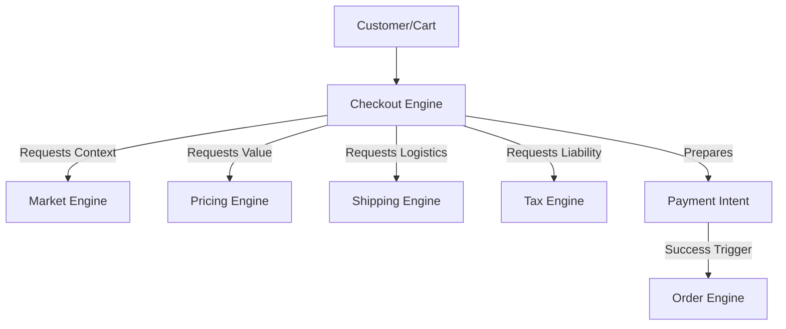
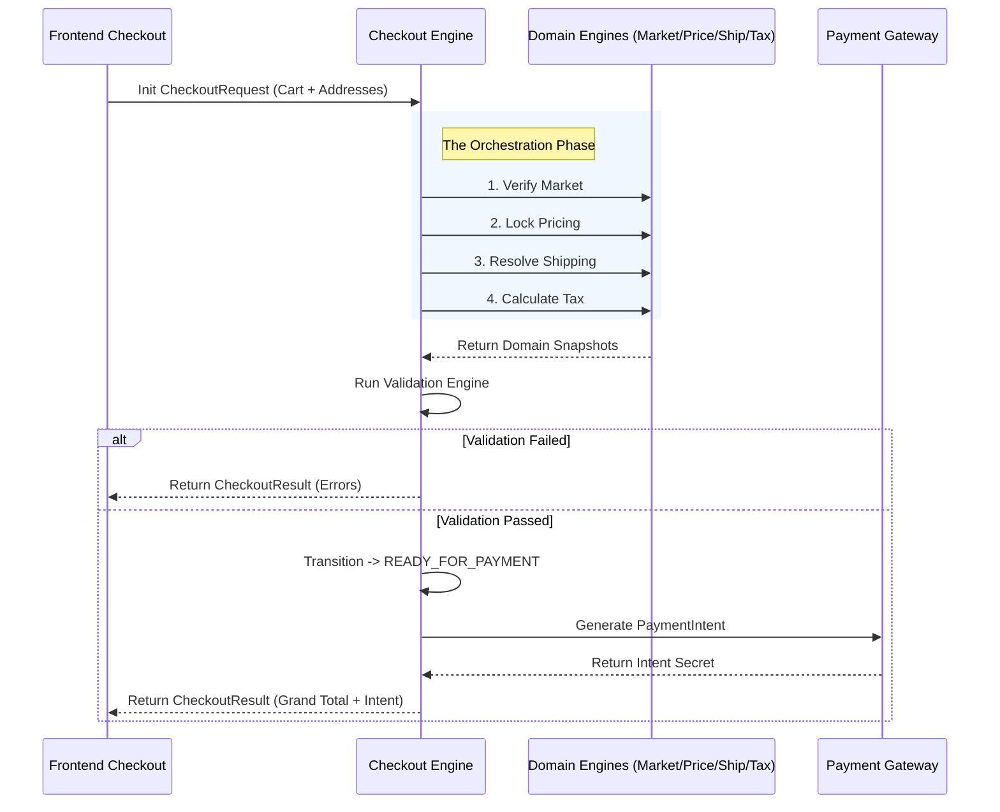

# Tezhhomayaa Enterprise Checkout Engine

This document serves as the permanent architecture and engineering guide for the Tezhhomayaa Enterprise Checkout Platform. It establishes the foundational blueprints for orchestrating global commerce transactions.

> [!IMPORTANT]
> The Checkout Engine is an **orchestration layer**. It is strictly prohibited from holding business rules. It never calculates prices, shipping, or taxes. It securely coordinates and validates the outputs of the Market, Pricing, Shipping, and Tax Engines.

---

## 1. Purpose

The Checkout Engine exists to bind the decoupled commerce subsystems into a single, validated transaction. 

By abstracting checkout into an orchestrator rather than a calculation engine, we ensure that:
- Checkout logic is never duplicated.
- Financial liabilities (Pricing, Tax, Shipping) remain securely locked in their respective domains.
- Checkout acts as the final gatekeeper, ensuring all inputs are perfectly aligned and legally compliant before initializing payment capture.

Checkout coordinates:
- The **Market** context.
- The **Pricing** calculations.
- The **Shipping** logistics.
- The **Tax** liabilities.
- The **Customer** identity and addresses.
- **Payment Preparation** and final **Validation**.

---

## 2. Checkout Philosophy

For Tezhhomayaa, the checkout experience must be invisible, frictionless, and utterly dependable.

The Checkout Engine must be:
- **Fast:** Operating with sub-second latency to prevent drop-off.
- **Reliable:** Gracefully handling partial engine failures or network timeouts.
- **Secure:** Mathematically verifying that no frontend data has been tampered with.
- **Composable:** Designed to plug seamlessly into distinct UIs (e.g., standard checkout, express checkout, iOS app).
- **Predictable:** Driven by strict state machines preventing race conditions.
- **Server-First:** All validation and intent generation occurs safely out of the client's reach.

---

## 3. Architecture Overview

The Checkout Engine is the apex consumer of the platform.

- **Market Engine:** Sets jurisdiction and currency.
- **Pricing Engine:** Sets catalog value and promotions.
- **Shipping Engine:** Sets delivery methods and costs.
- **Tax Engine:** Sets compliance and tax burdens.
- **Checkout Engine:** Orchestrates these responses, validates them, and bridges the gap to Payment and Order creation.

---

## 4. Checkout Session

The lifecycle of a checkout is governed by the **CheckoutSession** model. This is an immutable snapshot of a transaction at a point in time.

**Properties:**
- `sessionId`: Unique cryptographically secure identifier.
- `market`: Snapshot of the Market Engine context.
- `customer`: Customer profile (Guest or Authenticated).
- `cart`: Array of items and quantities.
- `pricingSnapshot`: Immutable reference to the total merchandise value.
- `shippingSnapshot`: Immutable reference to the chosen delivery method and cost.
- `taxSnapshot`: Immutable reference to the tax breakdown.
- `validationStatus`: Boolean flag confirming all engines are in harmony.
- `checkoutStatus`: Current state in the state machine (e.g., `READY_FOR_PAYMENT`).
- `createdDate`: ISO Timestamp.
- `expiry`: Time-To-Live (TTL) timestamp (typically 30 minutes, after which pricing and inventory must be re-verified).

---

## 5. Checkout Request

The Checkout Engine receives mutations via the **CheckoutRequest**. 

It is designed to cleanly ingest frontend UI state:
- `marketCode`: Context identifier (e.g., "AE").
- `customer`: Identifier or guest email.
- `cart`: Raw SKUs and requested quantities.
- `shippingAddress`: Destination payload for tax/logistics verification.
- `billingAddress`: Payment verification payload.
- `shippingMethodId`: User's chosen delivery speed.
- `paymentMethod`: (Future) Encrypted payment tokens or gateway identifiers.

---

## 6. Checkout Result

The Engine returns a consolidated **CheckoutResult**, allowing the frontend to render the final summary without performing any math.

- `pricingSummary`: Merchandise totals, discounts.
- `shippingSummary`: Freight cost, estimated delivery dates.
- `taxSummary`: Aggregated tax, line-item breakdowns.
- `grandTotal`: The final, exact amount to charge the customer.
- `validationErrors`: Hard blocks (e.g., "SKU out of stock", "Shipping address unserviceable").
- `warnings`: Soft alerts (e.g., "Price updated while in checkout").
- `checkoutStatus`: Reflection of the State Machine.

---

## 7. Validation Engine

The Checkout Engine's primary logic resides in its validations, executed in strict priority order to fail fast.

**Validation Hierarchy:**
1. **Market Supported:** Is the session occurring in an active jurisdiction?
2. **Products Available:** Does inventory exist for the entire cart?
3. **Customer Valid:** Are addresses formatted correctly and legally serviceable?
4. **Prices Valid:** Does the cart math match the server-side Pricing Engine exactly?
5. **Shipping Valid:** Does the chosen Shipping Method still exist and service the destination?
6. **Taxes Valid:** Did the Tax Engine successfully return a compliant breakdown?
7. **Checkout Ready:** Is the `grandTotal` > 0 and accurately summed?

---

## 8. Payment Preparation

Checkout acts as the precursor to Payment. It does **not** implement Stripe or PayPal directly.

Instead, once the `Validation Engine` passes, Checkout generates an abstract `PaymentIntent` payload. This payload contains the locked `grandTotal`, currency, and a reference to the `sessionId`. The actual Payment Gateway module consumes this intent to process the charge, keeping financial integrations cleanly decoupled.

---

## 9. Checkout State Machine

A checkout session transitions through a strict, unidirectional state machine.

1. **DRAFT:** Session initialized, addresses being collected.
2. **VALIDATED:** All required fields collected; engines have returned positive validation.
3. **READY_FOR_PAYMENT:** `PaymentIntent` generated and passed to the frontend.
4. **PAYMENT_PENDING:** Gateway is actively processing the charge.
5. **PAYMENT_FAILED:** Card declined; session reverts to VALIDATED.
6. **PAYMENT_SUCCESSFUL:** Charge captured; session locked.
7. **CANCELLED:** User explicitly aborted.
8. **EXPIRED:** TTL reached; cart released back to inventory.

> [!CAUTION]
> A session can only move to `PAYMENT_SUCCESSFUL` from `PAYMENT_PENDING`. State manipulation must be mathematically impossible from the frontend.

---

## 10. Security

- **Server-Side Validation:** The UI is treated as fundamentally untrustworthy. All pricing, shipping, and tax math is recalculated server-side during the `VALIDATED` transition.
- **Price Verification:** Mitigates cart tampering where malicious users alter HTML to set a $5,000 bag to $5.
- **Session Integrity:** Sessions are tied to cryptographic nonces; stealing a session ID does not grant access to the checkout state without the original browser fingerprint or Auth token.
- **Replay Protection:** Idempotency keys prevent a customer from accidentally being charged twice for the same `sessionId`.

---

## 11. API Flow

---

## 12. Performance

- **SSR:** The initial checkout hydration occurs server-side to ensure zero layout shift.
- **Minimal Recalculation:** The Engine uses hashing to detect if the cart or address changed. If only the user's phone number changes, it skips re-querying the Tax and Shipping Engines.
- **Immutable Snapshots:** Using references instead of massive JSON trees keeps the session payload lightweight in Redis/Memory.
- **Scalable Sessions:** State is decoupled from monolithic databases, allowing ephemeral sessions to scale infinitely during high-traffic drops.

---

## 13. CMS Integration

Future Admin interfaces will monitor the health and conversion of the Checkout platform:
- **Checkout Dashboard:** Real-time visibility into active, pending, and failed sessions.
- **Abandoned Checkouts:** Tools for customer support to view sessions stuck in `DRAFT`.
- **Recovery:** Automated workflows to email customers who abandoned a `VALIDATED` session.
- **Analytics:** Drop-off funnels mapping exactly which state transition failed most frequently.

---

## 14. Future Roadmap

- **Phase 1:** Architecture & Engine Foundations (Current)
- **Phase 2:** Checkout State Machine & Session Logic
- **Phase 3:** Payment Gateway API abstractions
- **Phase 4:** Guest Checkout workflows
- **Phase 5:** Authenticated Saved Addresses integration
- **Phase 6:** Express Checkout (Apple Pay / Google Pay integrations)
- **Phase 7:** Omni-channel / One-click Checkout

---

## 15. AI Development Rules

> [!CAUTION]
> **Mandatory rules for all future AI Agents interacting with this codebase:**
> 1. **NEVER** calculate prices in Checkout. Consume `PricingEngine`.
> 2. **NEVER** calculate taxes in Checkout. Consume `TaxEngine`.
> 3. **NEVER** calculate shipping in Checkout. Consume `ShippingEngine`.
> 4. **ALWAYS** respect the Validation Engine. Do not force a session to bypass checks.
> 5. **NEVER** mutate a `CheckoutSession` snapshot directly from the UI. State transitions must happen via secure server-side mutations.

---

## 16. Design Principles

- **Single Source of Truth:** Orchestration lives here, Business Logic lives elsewhere.
- **Server First:** Trust nothing from the client except intent.
- **Composable:** Designed as headless APIs capable of powering any frontend.
- **Secure:** Mathematically sound state machines and idempotency.
- **Scalable:** Ephemeral, high-performance session architecture.
- **Enterprise Grade:** Heavily typed, extensible, and built for edge cases.
- **Future Proof:** Readily supports new payment rails (crypto, BNPL) without touching the core validation engine.
