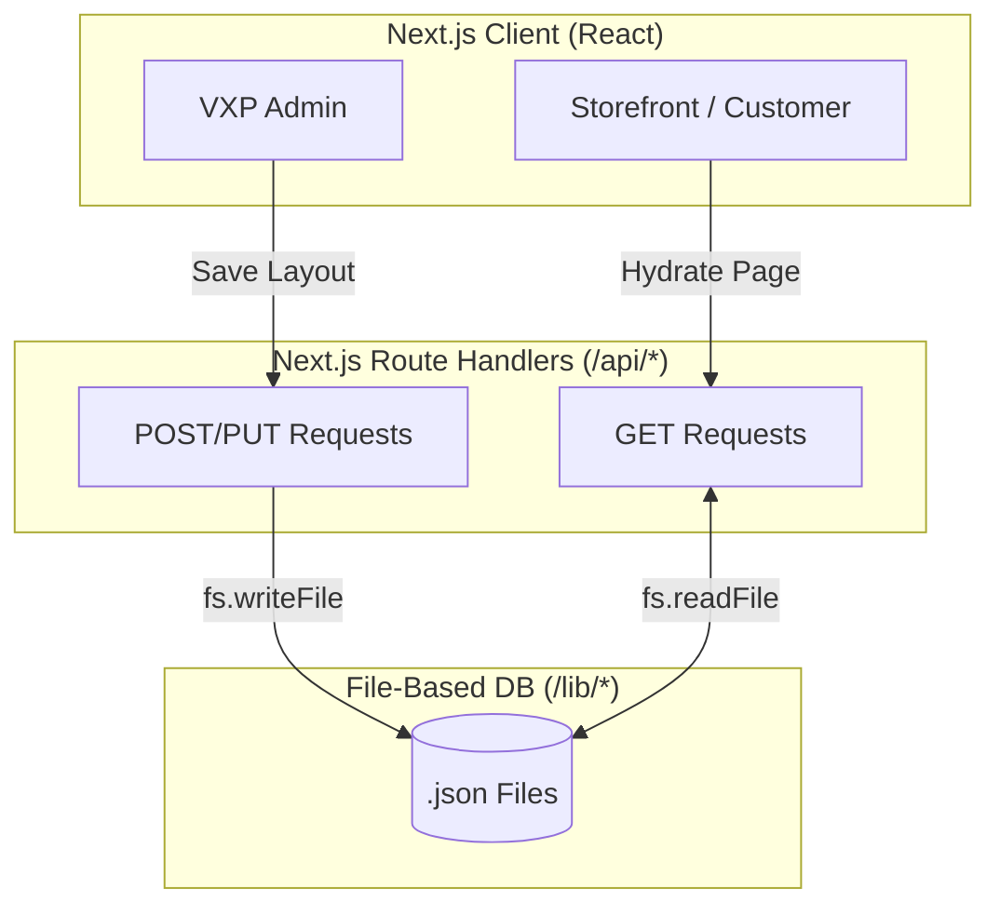

# Database Schema

## Vision

The Tezhhomayaa backend is designed for extreme portability and zero-latency static generation. During the initial architecture phase, a rigid SQL database would have bottlenecked rapid VXP prototyping. Instead, the project relies on a "File-Based Database" architecture, keeping the data models entirely decoupled from the frontend via strict API contracts.

## Current Storage Architecture

Currently, Tezhhomayaa utilizes **JSON File Storage** (`/lib/*.json`).

- **How it works**: Data is serialized into flat `.json` files. Next.js API routes (`/app/api/*`) act as pseudo-ORMs, utilizing Node.js `fs.readFile` and `fs.writeFile` to query and mutate the arrays.
- **Benefits**: 
  - **0ms Latency**: Fetching data during Static Site Generation (SSG) is instantaneous.
  - **Portability**: The entire database is checked into Git, allowing developers to clone the repo and immediately have a fully populated store without spinning up Docker or Postgres.
  - **Schema Fluidity**: VXP blocks can evolve their data structures instantly without requiring database migrations or `ALTER TABLE` commands.
- **Limitations**:
  - **Ephemeral Serverless Storage**: Cloud providers like Vercel spin up read-only lambda functions. `fs.writeFile` will succeed in memory but will *not* persist across requests or deployments.
  - **Concurrency**: File locking issues prevent multiple admins from safely saving the homepage at the exact same millisecond.

==================================================

## High Level Architecture



==================================================

## Data Models

### Products (`lib/products.json`)
- **Purpose**: Master catalog for the Commerce Engine.
- **Primary Key**: `id` (e.g., `imported_1`) and `slug`.
- **Relationships**: Belongs to `category`, possesses many `variants`, linked to `tags`.
- **Schema**:
```json
{
  "id": "string",
  "slug": "string (Unique)",
  "name": "string",
  "price": "number (Integer)",
  "image": "string (Cloudinary URL)",
  "hoverImage": "string",
  "gallery": "string[]",
  "category": "string",
  "tags": "string[]",
  "variants": [
    { "optionName": "Size", "option": "string", "price": "number" }
  ],
  "editorialDescription": "string",
  "status": "active | draft"
}
```

### Journal (`lib/journal.json`)
- **Purpose**: Editorial content storage.
- **Primary Key**: `id`.
- **Relationships**: Embeds VXP `sections` array.
- **Schema**:
```json
{
  "id": "string",
  "title": "string",
  "slug": "string (Unique)",
  "category": "string",
  "author": "string",
  "heroImage": { "url": "string", "alt": "string" },
  "sections": [
     // Contains full VXP Block Array (CanvasEngine)
  ]
}
```

### Lookbook (`lib/lookbook.json`)
- **Purpose**: Stores distinct campaign collections.
- **Primary Key**: `id`.
- **Schema**:
```json
{
  "id": "string",
  "name": "string",
  "subtitle": "string",
  "image": "string (Cloudinary URL)"
}
```

### Global VXP Models (`lib/homepage.json`, `lib/footer.json`)
- **Purpose**: Stores the nested block structure for specific standalone pages.
- **Schema**: Array of `VXP Block Objects` mapping directly to the `CanvasEngine`.

### Taxonomies (`lib/categories.json`, `lib/tags.json`)
- **Purpose**: Routing and search indexing arrays.
- **Schema**: Simple JSON arrays of strings or lightweight hierarchy objects.

### Missing Models (Needs Verification)
- **Users / Customers**: Not currently implemented in the JSON layer.
- **Orders / Inventory**: Handled via third-party gateways; static JSON cannot safely track live inventory deduction.
- **Subscribers**: Newsletter emails are not currently stored in the JSON layer.

==================================================

## JSON Structure (VXP Pattern)

The core reusable pattern across the CMS is the **VXP Block Object**. Found inside `homepage.json` and `journal.json`, it relies on a polymorphic `type` discriminator.

```json
{
  "id": "uuid_string",
  "type": "hero-slider | masonry-gallery | editorial-paragraph",
  "hidden": false,
  "data": {
    "content": {},
    "layout": {},
    "style": {},
    "animation": {}
  }
}
```
This deep tree structure requires `CanvasEngine` to use strict path-based deep-merging to update properties without destroying sibling data.

==================================================

## API Interaction

The API acts as a strict gateway to prevent the client from reading the filesystem directly.

- **Read Flow (GET)**: `fetch('/api/products')` -> Route Handler -> `fs.readFile()` -> `JSON.parse()` -> Returns serialized array to Client.
- **Write Flow (POST)**: `fetch('/api/homepage', { method: 'POST', body: sections })` -> Route Handler -> `JSON.stringify()` -> `fs.writeFile()`.
- **Update Flow (PUT)**: Not heavily utilized. The CMS currently relies on "Full Replace" via POST requests for safety.
- **Delete Flow (DELETE)**: Handled by sending a POST request with the targeted item removed from the array.

==================================================

## Migration Strategy

The architectural brilliance of this setup is that the **Frontend is completely agnostic to the database**. `CanvasEngine.tsx` and `store.tsx` do not know `.json` files exist; they only know that `/api/products` returns an array of objects.

To migrate to **PostgreSQL via Prisma** for production deployment on Vercel:

1. **Initialize Prisma**: Create a `schema.prisma` file directly mapping the JSON objects to relational tables.
2. **Swap the API Layer**: In `app/api/products/route.ts`, replace `fs.readFile()` with `prisma.product.findMany()`.
3. **Migrate VXP Blocks**: The `sections` array in `homepage.json` can be stored directly inside a PostgreSQL `JSONB` column on a `Page` table, requiring zero alterations to the massive `CanvasEngine` deep-merge logic.
4. **Result**: The UI, CMS, Storefront, and VXP remain 100% untouched.

==================================================

## Current Limitations

- **Search Bottleneck**: Because the database is a static JSON file, there is no native indexing or `LIKE '%query%'` SQL support. The entire 30,000+ line JSON file must be parsed into memory by the Node runtime to perform a search.
- **Data Integrity**: JSON lacks native foreign key constraints. If a Category string changes in `categories.json`, it does not cascade down to update the `products.json` file automatically.

## Future Improvements

1. **Prisma + PostgreSQL**: Execute the migration strategy outlined above to enable persistent writes on Vercel, native indexing, and relational safety.
2. **Redis Caching**: Once migrated to PostgreSQL, implement Redis (e.g., Upstash) on the edge to cache API GET requests, ensuring the 0ms latency achieved by JSON files is preserved in the relational architecture.
