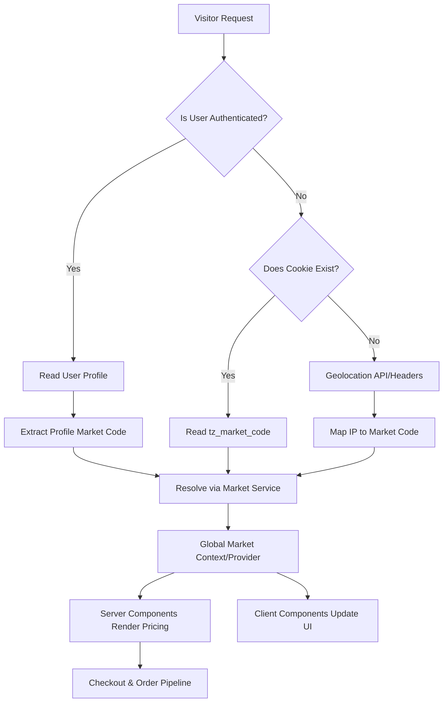

# Tezhhomayaa Global Market Selection Experience
**Product & UX Specification**

---

## 1. Purpose

The Tezhhomayaa platform implements a **Market Selection** strategy rather than a simplistic currency selector. In global luxury commerce, a user’s region dictates far more than just the display currency. 

The **Market** acts as the definitive source of truth across the entire platform. The selected Market determines:
- **Currency**: Display and transaction currency.
- **Regional Pricing**: Price-book assignments (e.g., localized pricing strategies vs. direct exchange rate conversion).
- **Tax Profile**: Region-specific tax configurations (e.g., India GST, UAE VAT).
- **Shipping Rules**: Fulfilment zones, carriers, and regional logistics profiles.
- **Warehouse**: Inventory source and allocation logic.
- **Payment Methods**: Region-specific gateways (e.g., Razorpay for India, Stripe for global).
- **Future Language**: Localized editorial content and interface translations.
- **Future Regional Campaigns**: Geo-specific marketing blocks and storytelling.
- **Future Regional Collections**: Merchandising strategies tailored to local tastes and climates.

By architecting the system around the *Market* rather than the *Currency*, Tezhhomayaa ensures a scalable, enterprise-grade foundation capable of supporting complex international operations. Currency is merely one property of a Market.

---

## 2. UX Philosophy

The Market Selector must embody the Tezhhomayaa luxury philosophy. It should never feel like a standard, intrusive e-commerce popup or a transactional hurdle. Instead, the experience should emulate the feeling of entering an international luxury fashion house—greeting the customer elegantly and anticipating their needs.

**Core Principles:**
- **Calm**: Interactions are smooth, intentional, and never sudden.
- **Editorial**: Typography and spacing are meticulously crafted.
- **Minimal**: Zero visual clutter; every element serves a distinct purpose.
- **Elegant**: Motion design relies on subtle eases and soft fades, not jarring bounces.
- **Confident**: The system intelligently anticipates the user's location without aggressive prompting.
- **Never Aggressive**: The selector should never interrupt the user mid-task or block their ability to browse entirely.
- **Never Promotional**: The selection experience is purely functional and hospitable, devoid of marketing jargon.

---

## 3. First Visit Flow

The initial encounter sets the tone for the entire brand experience. The flow leverages intelligent anticipation combined with user agency.

1. **Visitor opens website**: The initial request reaches the server.
2. **Global Market Engine detects IP**: Middleware securely analyzes the incoming request geolocation headers.
3. **Suggested Market is pre-selected**: The engine cross-references the geographic data against supported active markets.
4. **Luxury Market Selector appears**: A full-screen, exquisitely designed overlay gently fades in. It greets the user and elegantly displays their detected market and currency.
5. **Visitor confirms or changes Market**: The user can accept the pre-selection with a single click, or gracefully transition to a minimal list to choose an alternative region.
6. **Selection saved**: The confirmed market is securely written to a client-side cookie.
7. **Website loads**: The selector smoothly dissolves, revealing the localized editorial homepage.

---

## 4. Returning Visitor Flow

Frictionless re-entry is a hallmark of luxury service.

1. **Cookie exists**: The server immediately detects the `tz_market_code` cookie on the incoming request.
2. **No modal appears**: The Global Market Engine bypasses the First Visit Flow entirely.
3. **Market automatically loads**: The application server-side renders the localized content, pricing, and inventory.

This creates a seamless, "welcome back" experience where the brand remembers the customer's exact preferences without requiring repetitive interactions.

---

## 5. Logged-in Customer Flow

Authenticated users receive the highest priority of personalization.

1. **User Profile**: The customer authenticates securely.
2. **Stored Market**: The backend retrieves the user's permanent market preference saved to their profile.
3. **Overrides Cookie**: The user profile dictates the active market, overriding any conflicting local cookies or IP data.
4. **Website loads immediately**: The session is strictly bound to the customer's permanent region, ensuring consistent pricing and order history continuity.

---

## 6. Header Behaviour

The Market selection remains subtly accessible from the global navigation header at all times.

**Visual State:**
- Displayed quietly as a flag icon alongside the currency code (e.g., 🇮🇳 INR or 🇦🇪 AED).
- Positioned in the utility navigation (typically top right, adjacent to Search and Account).

**Interaction:**
- Clicking the indicator gently summons a unified Localization Drawer or Modal.
- The interface provides access to:
  - **Change Market**: Switch region and currency.
  - **Shipping Information**: View warehouse source and estimated delivery tiers for the active market.
  - **Future Language**: Toggle localized translations when available.

*Note: This behavior relies on future UI implementation; it must maintain strict adherence to the UX Philosophy detailed in Chapter 2.*

---

## 7. Future Expansion

The Market Engine is designed as the central nervous system for all regional operations. As the platform scales, the engine will integrate natively with:

- **Regional Pricing**: Dynamically switching to local price books rather than relying on live FX conversions.
- **Shipping Engine**: Dynamically rendering delivery timelines and costs based on the active market's mapped Warehouse and Shipping Profile.
- **Tax Engine**: Appending appropriate regional tax (e.g., Inclusive vs. Exclusive display, GST/VAT calculations).
- **Checkout**: Enforcing market-specific compliance, address validation rules, and restricting shipping destinations to the active zone.
- **Payment Gateways**: Surfacing localized payment methods (e.g., IDEAL, Razorpay, Tabby) conditionally based on the market array.
- **Translations**: Injecting localized dictionaries into the React rendering tree.
- **Regional Campaigns**: Toggling specific Hero Films or Shop Banners targeted at regional holidays (e.g., Diwali vs. Ramadan).
- **Regional Collections**: Hiding or prioritizing specific product lines based on regional inventory or seasonal climate.
- **Analytics**: Tagging all telemetry and conversion events with the active market code for granular regional reporting.

---

## 8. Accessibility

Luxury design mandates inclusivity. The Market Selector must be rigorously engineered for accessibility.

- **Keyboard Navigation**: Fully traversable using `Tab`, `Arrow Keys`, and `Enter`.
- **Escape closes selector**: Pressing `Esc` gracefully dismisses the interface (if dismissible).
- **Focus trapping**: When the selector is active, keyboard focus must be strictly contained within the modal to prevent background interaction.
- **Screen Readers**: All regions, buttons, and state changes must utilize appropriate `aria-labels`, `role="dialog"`, and `aria-live` regions to announce changes cleanly.
- **Reduced Motion**: Respects `prefers-reduced-motion` media queries, converting fluid eases into instant but elegant transitions.

---

## 9. Performance

The architecture guarantees that localization never compromises speed.

- **Only shown once**: The interactive selector is strictly gated behind cookie evaluation.
- **No layout shift**: Pre-rendered effectively to guarantee zero Cumulative Layout Shift (CLS).
- **Minimal JavaScript**: The selector UI is dynamically imported or lazily loaded to keep the critical main thread free.
- **SSR friendly**: Fully compatible with Next.js Server Components.
- **Cookie-first architecture**: Relying on HTTP-readable cookies allows the server to resolve the market *before* the first byte is sent to the client.
- **Fast loading**: The initial IP lookup is executed via highly optimized edge middleware or fast API routes.

---

## 10. Security

Market selection dictates pricing; therefore, data integrity is paramount.

- **Cookies**: Market preferences are stored in a secure, `SameSite=Lax` cookie.
- **Server Actions**: Future mutations (e.g., changing markets) are verified server-side.
- **No trust in client-side state**: Client-side storage (localStorage/cookies) is treated as a *preference*, but the server validates that the requested market code actually exists and is currently `enabled` before rendering pricing.
- **Future authentication**: When a user is logged in, their session token enforces the market boundary, protecting against price-tampering across regions.

---

## 11. Future CMS Integration

The Market ecosystem will eventually be manageable directly from the Tezhhomayaa Admin Dashboard.

**Markets Module:**
Administrators will have access to a dedicated module to manage global presence. For each Market, the CMS will control:

- **Country** (e.g., United Arab Emirates)
- **Currency** (e.g., AED)
- **Warehouse** (Inventory source routing)
- **Tax** (Tax profile assignment)
- **Shipping** (Carrier integration mapping)
- **Payment Methods** (Toggle active gateways)
- **Language** (Default localization)
- **Status** (Draft, Active, Suspended)
- **Default Market** (Boolean fallback)
- **Display Order** (UI sorting weight)

This integration ensures the engineering team does not need to deploy code simply to launch the brand in a new geographic region.

---

## 12. Technical Data Flow

The following illustrates the precise flow of data regarding Market Resolution:

**Layer Explanation:**
1. **Identification**: Determines if the request is tied to a hard permanent record (Auth).
2. **Preference**: Checks for a soft historical record (Cookie).
3. **Detection**: Utilizes network topology to guess intent (Geo-IP).
4. **Resolution**: The `MarketService` singleton sanitizes and validates the input against allowed data.
5. **Distribution**: `MarketContext` broadcasts the active state globally.
6. **Execution**: Downstream systems (Pricing, Checkout) confidently consume the state.

---

## 13. Future Roadmap

The evolution of the Global Market Engine is structured into sequential phases:

- **Phase 1: Global Market Engine ✅** 
  *Foundational architecture, Context API, and Service layer.*
- **Phase 2: Luxury Market Selector ✅** 
  *The front-end user experience and IP detection flow.*
- **Phase 3: Regional Pricing** 
  *Price books and localized discounting.*
- **Phase 4: Shipping Engine** 
  *Warehouse routing and delivery timeline calculations.*
- **Phase 5: Tax Engine** 
  *Automated inclusive/exclusive tax rendering based on jurisdiction.*
- **Phase 6: Payment Methods** 
  *Conditional rendering of gateways based on region.*
- **Phase 7: Localization** 
  *Translation dictionaries and RTL support.*
- **Phase 8: Regional Content** 
  *Market-specific CMS campaigns and visual merchandising.*
- **Phase 9: Regional Analytics** 
  *Segmenting business intelligence dashboards by market.*

---

## 14. Design Principles

When implementing the visual components for Phase 2, developers and designers must strictly adhere to these tenets:

- **Editorial**: Utilize ample whitespace and refined typography.
- **Minimal**: Strip away borders, heavy drop shadows, and unnecessary iconography.
- **Luxury**: It should evoke the feeling of interacting with a high-end concierge.
- **Timeless**: Avoid trendy UI patterns that will age poorly.
- **Quiet**: The UI speaks in a whisper, never shouting for attention.
- **Never feel like a standard ecommerce popup**: Discard standard "newsletter-style" modal layouts in favor of immersive, cinematic, or deeply integrated overlays.

---

## 15. Implemented Architecture (Phase 2)

**Component Hierarchy:**
- `MarketUIProvider`: React Context managing the modal's `isOpen` state and the initial cookie check.
- `StoreProviders`: Wraps the application with `MarketUIProvider` and renders `MarketDialog` at the root.
- `MarketDialog`: The luxury full-screen/bottom-sheet modal.
- `MarketCard`: Individual market options within the modal.
- `MarketHeader`: The Navbar component replacing the standard currency selector.

**Data Flow:**
1. On initial load, `MarketUIProvider` waits for the `MarketEngine` to finish its initialization.
2. If no `tz_market_code` cookie exists, `MarketUIProvider` sets `isOpen = true`, displaying `MarketDialog`.
3. The user selects a market via `MarketCard`.
4. `MarketDialog` calls `setMarket()` (from Phase 1's `MarketContext`), persisting the cookie and updating the global state.
5. The `MarketHeader` re-renders to reflect the newly selected market.

---
*End of Document*
