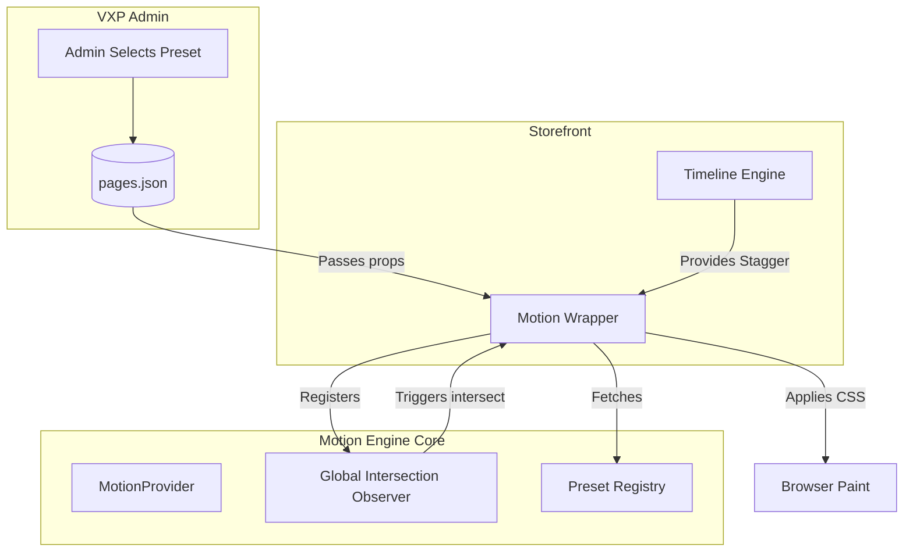

# Motion Engine

## Vision

The Motion Engine is built to guarantee that every interaction across the Tezhhomayaa OS reflects the brand's philosophy of "Quiet Luxury." Animations must never feel sporadic, aggressive, or disorganized. They should evoke the feeling of walking through a high-end physical space—slow, deliberate, and perfectly choreographed.

## Philosophy

Motion in luxury digital spaces is fundamentally different from standard web development.
- **Form Beyond Motion**: Motion exists strictly to support the content, not to distract from it.
- **Deliberate Pacing**: Transition durations are intentionally slow (often 800ms to 1600ms).
- **Accessibility as Standard**: "Reduced Motion" is not an afterthought; it is baked into the very core of the engine.

## Why a centralized Motion Engine was built

Rather than allowing developers or VXP administrators to apply ad-hoc CSS animations or chaotic JavaScript libraries across the codebase, the Motion Engine centralizes all movement. It acts as a strict gateway. If an animation is not registered in the `MotionPresets`, it cannot be used. This ensures 100% brand consistency, limits layout thrashing, and centralizes intersection observing for maximum browser performance.

==================================================

## High-Level Architecture

The Motion Engine relies on a global, context-driven architecture built over standard React hooks and CSS Transitions (eschewing heavy JS animation libraries for performance).

==================================================

## Module Implementation

### MotionProvider
The `<MotionEngineProvider>` (`MotionEngine.tsx`) wraps the entire application. It maintains:
- A singleton `IntersectionObserver`.
- A global `prefersReducedMotion` state tracking the user's OS-level accessibility settings.
- A `forceReplayKey` utilized exclusively by the VXP to force an instant replay of all active animations on the canvas.

### MotionWrapper
The core functional component (`MotionWrapper.tsx`). Instead of running Javascript animation loops, it leverages CSS transitions for maximum GPU efficiency.
- Receives a `preset` string, looking it up via `getPreset()`.
- Calculates its delay based on user input + its place within a `Timeline` (if any).
- Applies `willChange: "opacity, transform"` before the animation starts.
- Toggles between `initial` and `active` CSS states based on Intersection.

### TimelineEngine
The `<Timeline>` context coordinates complex stagger effects without heavy logic.
- Children call `timeline.registerChild()`.
- The Timeline returns an index multiplied by the `interval` (default 120ms).
- Result: Sequential "waterfall" reveals of products or images without the children needing to know about each other.

### Intersection Observer
To prevent the catastrophic performance hit of creating thousands of individual `IntersectionObservers`, the engine creates **one** global observer in the Provider.
- It tracks elements via `data-motion-id`.
- Fires slightly before the element enters the screen (`rootMargin: "0px 0px -10% 0px"`).
- Automatically unobserves the element after it fires once, freezing the animation state to save memory.

### Replay Motion
In the VXP Canvas, administrators need to see animations multiple times to choreograph them. 
- The VXP toolbar triggers `triggerReplay()`.
- This increments the `forceReplayKey`.
- `MotionWrapper` has `forceReplayKey` in its dependency array, instantly resetting its `isRevealed` state to `false`, then immediately triggering the Observer again.

### Reduced Motion
If `window.matchMedia("(prefers-reduced-motion: reduce)")` returns true, the engine intercepts the animation pipeline automatically:
1. The requested preset is overridden and falls back to `luxury-fade`.
2. All stagger delays are completely removed (`delay = 0`).
3. The duration is hard-capped at a maximum of `200ms`.
This ensures a snappy, cross-fade-only experience for users with vestibular disorders.

### Animation Presets
Registered inside `MotionPresets.ts`:

| Preset ID | Easing | Duration | Behavior |
| :--- | :--- | :--- | :--- |
| `none` | `linear` | 0ms | Instant rendering. |
| `luxury-fade` | `ease-out-quart` | 900ms | Standard elegant opacity fade. |
| `museum-reveal` | `ease-out-expo` | 1200ms | Slow 40px upward float while fading. |
| `cinematic-fade` | `ease-out-expo` | 1600ms | Slight scale down (1.05 -> 1) while fading. |
| `editorial-slide` | `ease-out-quart` | 1000ms | 40px horizontal slide reveal. |
| `soft-scale` | `ease-out-quart` | 800ms | Slight scale up (0.96 -> 1) to draw attention. |
| `curtain-reveal` | `ease-in-out-quint` | 1400ms | Uses `clip-path: polygon()` to unmask an image dynamically. |

==================================================

## Performance Optimizations

### Avoiding Layout Thrashing
The Motion Engine strictly prohibits animating CSS properties that trigger browser repaints or reflows (e.g., `width`, `height`, `margin`, `top`, `left`).
- **Implementation**: The engine forces `transitionProperty: "opacity, transform, clip-path"`.
- By exclusively animating composite properties, the browser offloads the work entirely to the GPU, preventing dropped frames on mobile devices.

### GPU Acceleration
- Every `MotionWrapper` injects `willChange: "opacity, transform"`.
- This signals the browser to create a separate composite layer for the element before the animation begins, eliminating painting delay during the actual transition.

==================================================

## Current Limitations

- **Directional Scroll Awareness**: The Intersection Observer only checks if an element has crossed the threshold. It does not know if the user is scrolling up or down. "Reveal out" animations when scrolling backward are not currently supported.
- **Parallax Limitations**: Because the engine relies on CSS transitions triggered by a binary state (`isRevealed`: true/false), it cannot natively bind CSS properties directly to the scroll-wheel delta (true parallax). 

## Future Improvements

- **Scroll-Linked Animations**: Extend the `MotionProvider` to include a global scroll listener (throttled via `requestAnimationFrame`) to pass scroll progress (0 to 1) down to a new `<ScrollMotionWrapper>`, allowing for true parallax while maintaining the centralized architecture.
- **Page Transition API**: Hook the Motion Engine into Next.js 16's App Router to orchestrate seamless, app-like page transitions (e.g., keeping a product image on screen while the surrounding layout changes).
