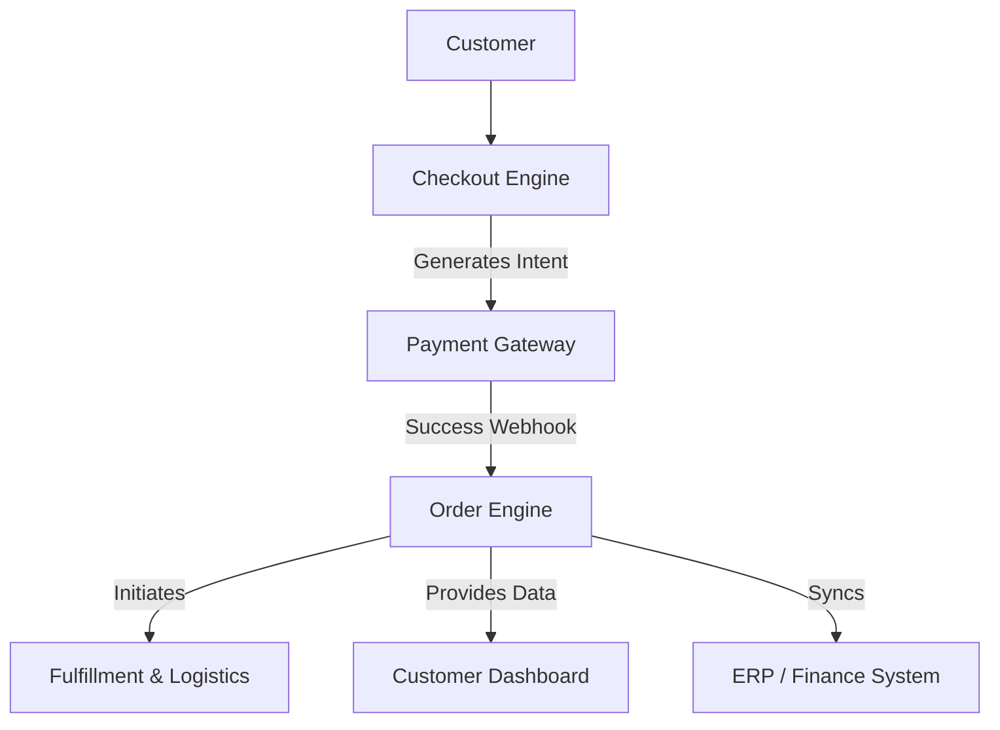
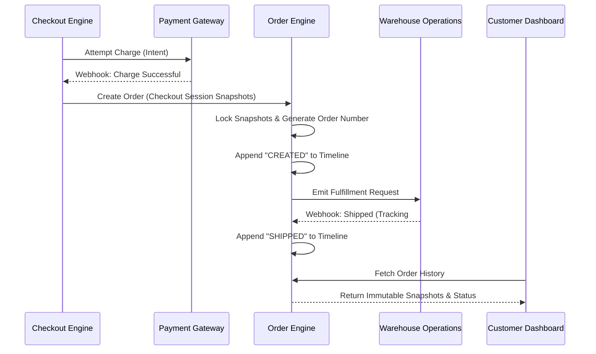

# Tezhhomayaa Enterprise Order Management Engine

This document serves as the permanent architecture and engineering guide for the Tezhhomayaa Enterprise Order Management Engine. It establishes the foundational blueprints for governing the lifecycle and historical records of all commerce transactions.

> [!IMPORTANT]
> The Order Engine is the ultimate system of record for completed purchases. Unlike the Checkout Engine (which orchestrates active sessions), the Order Engine owns immutable historical documents. It **never** recalculates prices, taxes, or shipping.

---

## 1. Purpose

The Order Engine exists to act as the permanent financial and operational ledger for the business.

It definitively owns:
- **Order Creation:** Transforming a successful Checkout Session into a permanent business entity.
- **Order Number Generation:** Creating legally and operationally distinct identifiers.
- **Order Lifecycle:** Managing the progression from unfulfilled to delivered.
- **Order Timeline:** Recording every physical and systemic event applied to the order.
- **Order Snapshots:** Storing the exact frozen state of the market, pricing, shipping, and tax at the moment of purchase.
- **Fulfillment Status:** Tracking the shipment of goods.
- **Invoice Relationship:** Linking the legal tax document to the physical order.
- **Customer Order History:** Providing the data layer for post-purchase CRM.

---

## 2. Order Philosophy

An Order is fundamentally a legal and historical record. 

For Tezhhomayaa, an Order must reflect absolute truth. Once a customer successfully pays, the financial snapshots associated with that order must **never change**, even if a product's price is increased the next day, or a tax law is updated the next month.

Orders are immutable contracts.

---

## 3. Architecture Overview

The Order Engine sits downstream of the Checkout Engine and acts as the bridge between the digital transaction and physical fulfillment.

- **Checkout Engine:** Secures the state and authorizes payment.
- **Payment Gateway:** Captures funds.
- **Order Engine:** Consumes the successful intent to create the immutable record.
- **Fulfillment:** Warehouses consume the order to pick, pack, and ship.
- **Customer Dashboard:** Reads the order for CRM visibility.
- **ERP:** Reads the order for general ledger accounting.

---

## 4. Order Model

The core data model is designed to be self-contained and fully independent of live product or pricing data.

**Properties:**
- `orderId`: Unique cryptographically secure database identifier.
- `orderNumber`: Human-readable identifier (e.g., `TZ-IN-10045`).
- `customerSnapshot`: Captured details (Name, Email, Phone).
- `marketSnapshot`: Captured jurisdiction and currency.
- `pricingSnapshot`: Captured merchandise catalog values and applied discounts.
- `shippingSnapshot`: Captured chosen method, cost, and destination address.
- `taxSnapshot`: Captured liability and compliance metadata.
- `checkoutSnapshot`: Reference to the original validation session.
- `status`: Current operational state (e.g., `UNFULFILLED`, `SHIPPED`).
- `timeline`: Array of historical events.
- `createdDate`: ISO Timestamp.
- `updatedDate`: ISO Timestamp.
- `version`: Optimistic locking integer to prevent race conditions during fulfillment updates.

---

## 5. Order Timeline

The Order Timeline provides a legally auditable history of everything that occurs post-purchase.

Each event object includes:
- `timestamp`: Exactly when the action occurred.
- `actor`: Who triggered it (e.g., "System", "Admin: John", "Carrier Webhook").
- `action`: The event type.

**Example Timeline:**
1. `CREATED`: Order finalized by Checkout.
2. `CONFIRMED`: Payment cleared and verified.
3. `PACKED`: Warehouse scanned the SKUs into a parcel.
4. `SHIPPED`: Carrier generated a tracking number.
5. `DELIVERED`: Carrier confirmed receipt by customer.
6. `CANCELLED` / `RETURNED` / `REFUNDED`: Exception flows.

---

## 6. Order State Machine

The Order Engine enforces strict operational transitions. Illegal transitions must be structurally impossible.

**Valid Transition Flow:**
`UNFULFILLED` → `PARTIALLY_FULFILLED` / `FULFILLED`
`FULFILLED` → `SHIPPED`
`SHIPPED` → `DELIVERED`

**Hard Enforcements:**
- An order that is `DELIVERED` cannot return to `PACKED`.
- An order that is `CANCELLED` cannot become `DELIVERED`.
- A `REFUNDED` status can only be applied to orders that have been successfully billed.

---

## 7. Order Number Strategy

Order numbers must be customer-friendly, sequentially logical, and regionally distinct to aid warehouse sorting and financial auditing.

**Format Strategy:** `[BRAND]-[REGION]-[SEQUENCE]`
- Example: `TZ-IN-001452` (Tezhhomayaa, India Market, Sequential ID).
- Example: `TZ-AE-008911` (Tezhhomayaa, UAE Market, Sequential ID).

The sequence must guarantee uniqueness and scalability, utilizing atomic database counters or distributed ID generators (like Snowflake) disguised in a clean format.

---

## 8. Fulfillment Integration

The Order Engine dictates *what* must be shipped, while the Shipping Engine dictates *how* it should be routed.
- Upon order creation, the Order Engine notifies the designated `Warehouse` (resolved earlier by the Shipping Engine).
- The Warehouse system consumes the Order's `pricingSnapshot.cartItems` to pick goods.
- When the warehouse dispatches the parcel, it patches the Order Engine with tracking metadata, advancing the timeline to `SHIPPED`.

---

## 9. Invoice Relationship

Every Order requires a legally binding Tax Invoice.
- The Order Engine is the source of truth for the financial data, but it does *not* generate PDFs.
- A 1:1 (or 1:N for split shipments) relationship exists between `Order` and `Invoice`.
- External invoicing microservices will consume the Order's `taxSnapshot` and `pricingSnapshot` to construct compliant documents without requiring the Order Engine to format them.

---

## 10. Customer Order History

The Customer Dashboard UI purely acts as a read-only consumer of the Order Engine.
- It requests historical orders by `Customer ID`.
- It displays the immutable `pricingSnapshot` (so if a bag was $1000 last year, but is $1200 today, the order history correctly shows $1000).
- It displays the most recent `timeline` event to provide accurate shipping status.

---

## 11. API Flow

---

## 12. Security

- **Immutable Financial Snapshots:** The database schema must reject any update operations targeting the pricing, shipping, or tax payload objects after initial creation.
- **Audit Trail:** Every status change requires an actor identity to prevent silent data manipulation.
- **Authorization:** Only authenticated Customer accounts can view their own orders. Admin keys are required to patch fulfillment states.
- **Order Integrity:** Checksums generated at checkout are stored in the order to guarantee no data degradation occurred between systems.

---

## 13. Performance

- **Fast Lookups:** `orderNumber` and `customerId` must be heavily indexed for high-speed retrieval.
- **Indexing Strategy:** Utilize compound indexes on `[customerId, createdDate]` for optimal CRM dashboard rendering.
- **Pagination:** Order history endpoints must enforce cursor-based pagination.
- **Caching:** Completed orders (e.g., older than 30 days) can be heavily cached via CDN/Redis as their state is mathematically guaranteed never to change.

---

## 14. Future Roadmap

- **Phase 1:** Architecture & Engine Foundations (Current)
- **Phase 2:** Backend Foundation (Order Models, Number Generation)
- **Phase 3:** Fulfillment Webhooks & State Transitions
- **Phase 4:** Returns & Reverse Logistics
- **Phase 5:** Financial Refunds
- **Phase 6:** Exchanges & Complex Cart Modifications

---

## 15. AI Development Rules

> [!CAUTION]
> **Mandatory rules for all future AI Agents interacting with this codebase:**
> 1. **NEVER** modify historical snapshots (Pricing, Tax, Shipping) after an order is created.
> 2. **NEVER** attempt to recalculate an order's value post-purchase.
> 3. **ALWAYS** consume snapshots when displaying order history; never fetch live catalog prices.
> 4. **NEVER** bypass the Order Engine state machine to force a status.

---

## 16. Design Principles

- **Immutable Records:** Historical accuracy supersedes live catalog data.
- **Single Source of Truth:** If there is a dispute, the Order Engine's snapshot wins.
- **Auditability:** Every action leaves a cryptographic fingerprint.
- **Reliability:** Decoupled from volatile frontend systems.
- **Scalability:** Built to handle thousands of concurrent checkouts finalizing at once.
- **Enterprise Grade:** Fully structured for ERP general ledger consumption.
- **Future Proof:** Readily supports multi-warehouse split-shipments and advanced omni-channel returns.
