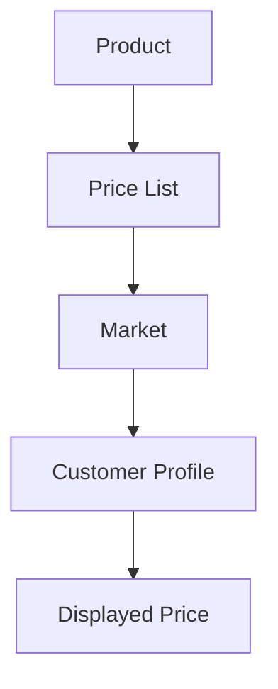
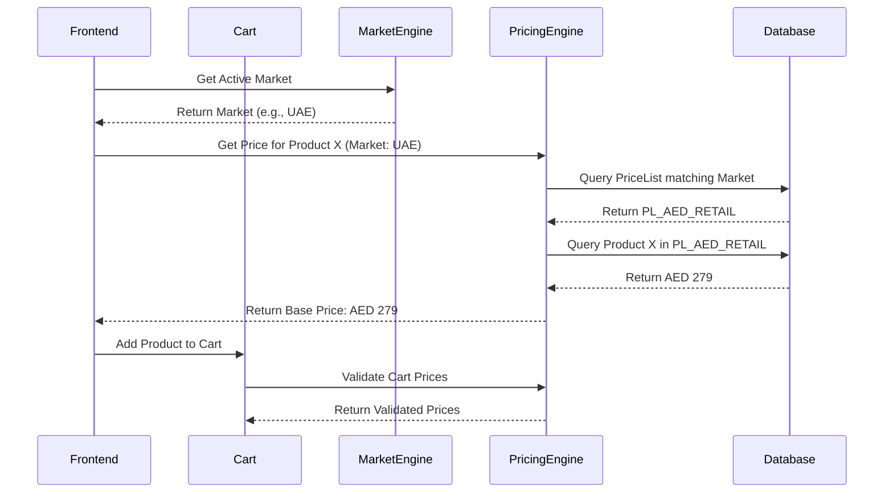
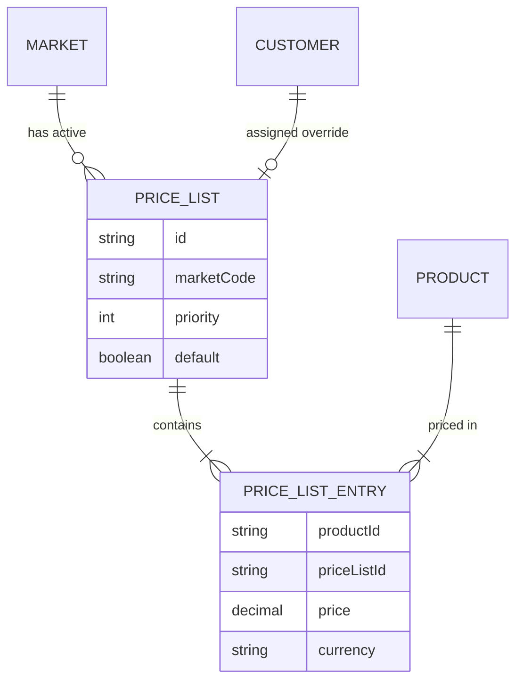
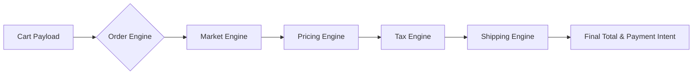

# Tezhhomayaa Enterprise Pricing Engine

This document serves as the permanent architecture and engineering guide for the Tezhhomayaa Enterprise Pricing Engine. It outlines the strategic, architectural, and operational foundations for how pricing is resolved across a global luxury fashion platform. 

> [!IMPORTANT]
> The Pricing Engine is the singular source of truth for all base prices displayed and transacted on the platform.

---

## 1. Purpose

The Pricing Engine exists to decouple currency presentation from commercial strategy. Tezhhomayaa uses **Price Lists** rather than simple currency conversion. 

A Market owns its own pricing. **Currency conversion is NEVER used for customer pricing.** Instead, each Market executes an independent commercial strategy tailored to its regional positioning, taxes, duties, and perceived luxury value. 

**Example Pricing Strategy:**
- **India:** ₹5,999
- **UAE:** AED 279
- **Singapore:** SGD 99

These are manually managed, static prices explicitly set by the merchandising team. They are not subjected to live FX fluctuations.

---

## 2. Pricing Philosophy

Luxury brands never price by live exchange rates. Live exchange rates create volatile, unpredictable numbers (e.g., AED 278.43) which erode the premium, curated feel of a luxury brand.

Each Market receives carefully curated, rounded pricing. The Pricing Engine is designed to support **commercial decisions rather than mathematical conversions.** Stability and intentionality in pricing are paramount to the "Quiet Luxury" philosophy.

---

## 3. Architecture Overview

The architecture enforces a strict hierarchical resolution to determine the final displayed price.

- **Product:** The root item being sold. It holds no intrinsic single price; rather, it possesses a matrix of prices.
- **Price List:** A localized catalog of prices (e.g., `pl_inr_retail`, `pl_aed_wholesale`).
- **Market:** The geographic/commercial context the user is currently browsing within.
- **Customer Profile:** The specific segmentation of the user (e.g., Guest, VIP, Distributor).
- **Displayed Price:** The single, absolute value presented to the frontend after traversing the hierarchy.

---

## 4. Price Lists

A Price List is the foundational model of the Pricing Engine. It represents a specific commercial strategy for a specific currency and context.

Each Price List contains:
- `id`: Unique identifier (e.g., `pl_12345`)
- `priceListCode`: Human-readable identifier (e.g., `PL_AED_RETAIL`)
- `priceListName`: Display name (e.g., `UAE Retail Catalog`)
- `marketCode`: The designated market (e.g., `AE`)
- `currency`: Currency code (e.g., `AED`)
- `status`: Active, Draft, or Archived
- `effectiveDate`: Timestamp for when the pricing goes live
- `expiryDate`: Optional timestamp for when the pricing ends
- `priority`: Integer defining override rank
- `defaultPriceList`: Boolean indicating if this is the fallback for the market

---

## 5. Product Pricing

Every Product inherently contains multiple prices mapped across various Price Lists.

**Example: Silk Shirt**
- **India:** ₹5,999
- **UAE:** AED 279
- **Singapore:** SGD 99

**Future Contextual Overrides:**
- **Wholesale UAE:** AED 210
- **VIP UAE:** AED 250

The relationship is fundamentally a one-to-many map: `Product -> [PriceListEntry]`. When a product is requested, the Engine queries the specific `PriceListEntry` corresponding to the active Price List.

---

## 6. Pricing Resolution

The resolution strictly follows this top-down order to ensure only one final price is surfaced:

1. **Customer Context:** Identify the customer segment (e.g., Retail vs VIP).
2. **Market Context:** Identify the browsing Market (e.g., UAE).
3. **Assigned Price List:** Based on Customer + Market, select the highest priority active Price List.
4. **Product Price:** Fetch the specific value for the Product within that Price List.
5. **Displayed Price:** Return the scalar value to the UI.

> [!CAUTION]
> Only **one** price is ever returned and displayed. The frontend must never receive an array of prices and attempt to resolve them client-side.

---

## 7. Future Pricing Types

The architecture is designed to support the following future expansions without core refactoring:

- **Retail:** Standard B2C pricing for general consumers.
- **Wholesale:** Bulk B2B pricing with MOQs (Minimum Order Quantities).
- **Distributor:** Deeply discounted pricing for exclusive regional distribution partners.
- **VIP:** Specialized tier pricing for top-spending retail clients.
- **Employee:** Internal staff discount pricing.
- **Marketplace:** Pricing synced specifically for external channels (e.g., Farfetch, Ounass).
- **Outlet:** End-of-season markdown pricing.
- **Seasonal Collection:** Temporal pricing assigned to specific capsule drops.
- **Archive Collection:** Premium pricing for rare, vaulted items.

---

## 8. Discounts

> [!WARNING]
> **Implementation Note:** Discounts are NOT currently implemented. This section serves as documentation for future capabilities.

Future support will include:
- Percentage Discounts (e.g., 15% off)
- Fixed Discounts (e.g., ₹500 off)
- Market-specific Discounts (only valid in UAE)
- Collection Discounts (only valid on the Silk Collection)
- VIP Discounts (auto-applied based on Customer profile)
- Coupon Discounts (manual code entry)
- Automatic Discounts (rule-based triggers in cart)

---

## 9. Taxes

Taxes strictly belong to the **Tax Engine**. 
The Pricing Engine must expose the **base price only**. Tax calculations, inclusive/exclusive presentation logic, and VAT extractions happen downstream during the Order and Checkout lifecycle based on the Market's `taxProfile`.

---

## 10. Shipping

Shipping strictly belongs to the **Shipping Engine**.
Shipping costs are never included or modeled inside the Pricing Engine. The Pricing Engine evaluates the cost of the *merchandise*, while the Shipping Engine evaluates the cost of *fulfillment*.

---

## 11. Checkout

The Checkout system acts purely as a consumer of the Pricing Engine.
- Checkout **never** calculates prices.
- Checkout **only** requests the securely resolved price from the backend API.
- Checkout recalculates the cart by querying the Pricing Engine immediately before payment intent creation to prevent data staleness.

---

## 12. CMS Integration

Future Admin interfaces will manage pricing through a top-down hierarchy:

**Admin Flow:** `Pricing Dashboard -> Price Lists -> Markets -> Products`

**Future Screens:**
1. **Price List Manager:** Create and schedule price lists.
2. **Market Assigner:** Map specific price lists to specific markets.
3. **Product Pricing Matrix:** A spreadsheet-like view to edit a single product's price across all active Price Lists simultaneously.

---

## 13. API Flow

The API flow guarantees secure, server-side resolution before data reaches the client.

---

## 14. Data Validation

To maintain data integrity, the following validation rules apply:
- Every active Product **must** have a defined Retail Price.
- Every active Product **must** be assigned to at least one Market.
- Every Price List entry **must** specify a valid Currency.
- A Product **cannot** have duplicate entries within the same Price List.

*Future validation:* Scheduled Price Lists cannot overlap in effective dates if they share the exact same priority, market, and customer segment.

---

## 15. Performance

The Pricing Engine is optimized for scale:
- **Caching:** Resolved prices are heavily cached via Redis/Edge networks based on the `ProductId + PriceListId` composite key.
- **SSR Compatibility:** Designed to pre-fetch prices during Next.js Server-Side Rendering.
- **Fast Lookup:** Database indices prioritize the `(price_list_id, product_id)` tuple.
- **No N+1 Queries:** Prices are batched when fetching category or grid views.
- **Scale:** Engineered to handle tens of thousands of SKUs across dozens of markets in sub-50ms latency.

---

## 16. Security

- **Server-Side Pricing:** All pricing logic executes securely on the server.
- **Zero Trust:** Never trust prices submitted by the frontend payload. 
- **Checkout Validation:** The cart and checkout endpoints re-fetch and validate all prices against the database immediately prior to transaction.
- **Manipulation Prevention:** Payload tampering (e.g., altering `price` in a POST request) is silently ignored; the server relies entirely on its own Pricing Engine resolution.

---

## 17. Future Roadmap

- **Phase 1:** Architecture & Engine Foundations (Current)
- **Phase 2:** Retail Pricing (Base Implementation)
- **Phase 3:** Regional Pricing Extensions
- **Phase 4:** Wholesale Architecture
- **Phase 5:** VIP & Tiered Pricing
- **Phase 6:** Promotions & Discount Engine
- **Phase 7:** Marketplace Pricing Integrations
- **Phase 8:** Algorithmic & Dynamic Pricing

---

## 18. Technical Diagrams

### Core Entity Relationships

### Checkout Validation Lifecycle

---

## 19. Design Principles

- **Single Source of Truth:** The Pricing Engine is the definitive authority on merchandise cost.
- **Server Authoritative:** The client dictates context (who/where they are), but the server dictates the price.
- **Market Driven:** Commercial strategy supersedes automated FX math.
- **Scalable:** Built to cache efficiently at the edge.
- **Modular:** Completely decoupled from Taxes, Shipping, and Cart logic.
- **Future Proof:** Tiered Price Lists allow infinite combinations of VIP/B2B contexts.
- **Enterprise Grade:** Heavily typed, rigorously validated, and audit-ready.

---

## 20. AI Development Rules

> [!IMPORTANT]
> **Directives for all future AI Agents interacting with this codebase:**
> 1. **NEVER** calculate prices using exchange rates or math formulas.
> 2. **NEVER** duplicate pricing logic inside UI components, cart routines, or checkout services.
> 3. **ALWAYS** consume the Pricing Engine for any price-related queries.
> 4. **NEVER** hardcode prices inside React components or mock files (unless isolated to strict unit testing).
> 5. **ALWAYS** resolve prices through the abstraction of Price Lists. Do not attempt direct `Product.price` property reads.
