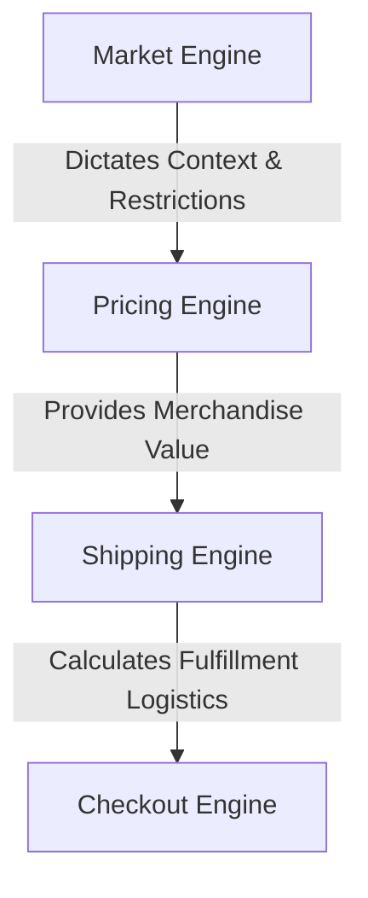
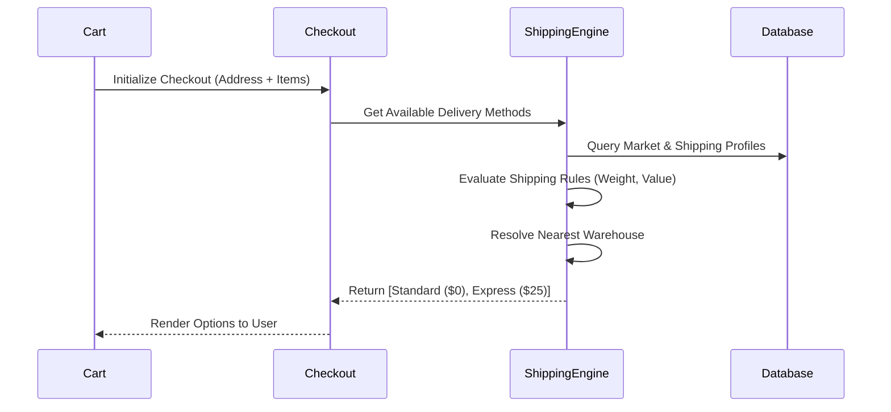

# Tezhhomayaa Enterprise Shipping & Fulfillment Engine

This document serves as the permanent architecture and engineering guide for the Tezhhomayaa Enterprise Shipping & Fulfillment Engine. It establishes the technical framework required to support global logistics for a luxury fashion platform.

> [!IMPORTANT]
> The Shipping Engine is the single source of truth for all fulfillment logic, including Shipping Zones, Warehouses, Delivery Methods, and Delivery Promises. It operates independently of the Pricing and Tax Engines.

---

## 1. Purpose

The Shipping Engine exists as an independent, decoupled module to handle the immense complexity of global fulfillment. 

The Shipping Engine definitively determines:
- The optimal **Warehouse** to fulfill an order from.
- The available **Shipping Methods**.
- The guaranteed **Delivery Promise** presented to the customer.
- The final **Shipping Cost**.
- The ultimate **Carrier** responsible for last-mile delivery.

> [!CAUTION]
> The Shipping Engine **never** calculates merchandise pricing, nor does it calculate localized sales tax or VAT. It strictly governs the cost and logistics of fulfillment.

---

## 2. Shipping Philosophy

For Tezhhomayaa, luxury customers are purchasing **certainty**, not merely delivery.

The Shipping Engine must prioritize:
- **Reliability:** Fulfillment routing must never fail or offer impossible delivery windows.
- **Transparency:** Clear, accurate costs and dates presented pre-checkout.
- **Predictable Delivery:** Upholding the "Quiet Luxury" standard means eliminating shipping anxiety.
- **Market-Aware Fulfillment:** Adapting dynamically to the customer's geographic and commercial market.
- **Premium Customer Experience:** Clean UI data, avoiding messy carrier-speak (e.g., displaying "Priority Worldwide" instead of "FedEx Int. Economy 3-Day").

---

## 3. Architecture Overview

The Shipping Engine sits downstream of the Market and Pricing Engines, consuming their outputs to finalize the logistical cost before entering the Checkout transaction phase.

- **Market Engine:** Validates that shipping to the user's location is legally/commercially supported.
- **Pricing Engine:** Provides the cart subtotal required to evaluate shipping rules (e.g., Free Shipping thresholds).
- **Shipping Engine:** Resolves the optimal warehouse, method, and cost.
- **Checkout Engine:** Consumes the resolved shipping data to generate the final payment intent.

---

## 4. Shipping Profiles

The core data model of the Shipping Engine is the **Shipping Profile**.

A Shipping Profile governs how a specific segment of fulfillment operates. It contains:
- `shippingProfileCode`: Unique string identifier (e.g., `SP_GCC_PRIORITY`).
- `marketCodes`: Array of supported Markets (e.g., `["AE", "SA", "QA"]`).
- `warehouseId`: The designated fulfillment center.
- `deliveryMethods`: Array of supported methods (e.g., Standard, Express).
- `freeShippingThreshold`: The minimum order value (MOV) required to waive shipping costs.
- `estimatedDelivery`: Human-readable promise (e.g., "1–3 Business Days").
- `status`: Active, Draft, or Archived.
- `priority`: Override rank (highest integer wins if multiple profiles match).
- `isDefault`: Boolean fallback indicator.

---

## 5. Shipping Zones

Global logistics are partitioned into logical **Shipping Zones** to simplify rate card management.

Future support will include:
- **Domestic:** Immediate vicinity of the brand headquarters (e.g., India).
- **GCC:** High-priority luxury corridors (e.g., UAE, Saudi Arabia, Qatar).
- **Asia Pacific:** Expansive eastern markets (e.g., Singapore, Japan, Australia).
- **Europe:** Complex VAT and cross-border zones (e.g., UK, France, Germany).
- **North America:** Massive, high-volume regions (e.g., US, Canada).
- **Rest of World (RoW):** Fallback zoning for expansive international delivery.

Zones exist to prevent the need for defining shipping rates at an exhausting per-country level. Instead, rules are applied at the Zone level and inherited by the Markets within that Zone.

---

## 6. Warehouse Resolution

To guarantee fulfillment speed, the Engine dynamically resolves the originating **Warehouse**.

Future support will scale from simple to highly complex routing:
- **Single Warehouse:** All global shipments originate from a central Hub.
- **Multiple Warehouses:** Geographically dispersed hubs (e.g., Mumbai, Dubai, London, New York).
- **Nearest Warehouse:** Algorithmic routing based on customer postal code or geolocation.
- **Inventory-Aware Routing:** Routing based on real-time SKU availability, preventing stock-outs by shifting fulfillment to secondary hubs when the primary is empty.

---

## 7. Delivery Methods

The Engine abstracts raw carrier services into branded **Delivery Methods**.

Future support will include:
- **Standard:** The baseline delivery tier.
- **Express:** Expedited fulfillment.
- **Priority:** Top-tier, next-day, or same-day concierge delivery (reserved for VIPs or specific urban zones like Dubai/Mumbai).
- **Scheduled Delivery:** Allowing the customer to pick an exact future delivery window.
- **Store Pickup:** Omni-channel routing to physical flagship boutiques.

---

## 8. Delivery Promise Engine

The "Estimated Delivery" presented to the user is calculated deterministically, not guessed.

**Resolution Flow:**
`Market Context` → `Assigned Warehouse` → `Selected Delivery Method` → `Estimated Delivery Promise`

> [!NOTE]
> Promises are strictly controlled by the Shipping Engine. A frontend component must never hardcode text like "Arrives in 3 days." It must always render the string returned by the Shipping Engine.

---

## 9. Shipping Rules

The Engine evaluates strict rules against the cart before exposing a Delivery Method.

Support includes:
- **Free Shipping:** Triggered when the cart subtotal (via Pricing Engine) exceeds the `freeShippingThreshold`.
- **Minimum Order Value:** Rejecting checkout if the cart is too small for a specific zone.
- **Heavy Products:** Surcharges applied to specific SKUs based on weight metadata.
- **Oversized Products:** Surcharges or restriction to specific freight carriers based on dimensional metadata.
- **Restricted Regions:** Blocking fulfillment to unserviceable postal codes or embargoed nations.
- **Future Hazardous Goods:** Restricting air-freight on specific items (e.g., perfumes, batteries).

---

## 10. Checkout Integration

The Checkout system acts purely as a consumer of the Shipping Engine.
- Checkout **never** calculates shipping rates.
- Checkout queries the Shipping Engine with the verified Cart and Destination Address.
- The Shipping Engine returns a locked array of available `DeliveryMethods`.
- Upon user selection, Checkout commits the chosen method to the Order Engine.

---

## 11. Future Carrier Integrations

The architecture is built to eventually support API integrations with global carriers for automated label generation and rate lookup:
- DHL
- FedEx
- UPS
- Aramex (Crucial for GCC/MENA)
- Blue Dart (Crucial for Domestic India)
- Shiprocket (Aggregator)
- Delhivery

---

## 12. Tracking Architecture

Post-purchase, the Shipping Engine pivots to a tracking role.

**Shipment Lifecycle:**
`Order Created` → `Shipment Generated` → `Tracking Number Assigned` → `Carrier API Polled` → `Delivery Status Updated` → `Customer Dashboard Displayed`

This ensures customers never have to leave the Tezhhomayaa domain to track their luxury goods.

---

## 13. Returns (Future)

Returns are treated as reverse-logistics within the Shipping Engine.

**Future Architecture:**
`Customer Return Request` → `Admin Approval` → `Carrier Pickup Scheduled` → `Warehouse Receiving` → `Quality Inspection` → `Order Engine Refund Triggered`

---

## 14. CMS Integration

Future Admin interfaces will manage logistics through a dedicated configuration tree:

**Admin Flow:** `Shipping Dashboard -> Shipping Zones -> Warehouses -> Shipping Profiles -> Shipping Rules`

This allows operations teams to alter rate cards, disable warehouses, or adjust free-shipping thresholds dynamically without developer intervention.

---

## 15. API Flow

---

## 16. Security

- **Server-Side Calculation:** Shipping costs are generated exclusively on the server.
- **No Frontend Logic:** The UI cannot determine if a user qualifies for Free Shipping; it must ask the API.
- **Validation:** Address verification occurs before hitting the Shipping Engine to prevent rate-lookup failures.
- **Auditability:** All shipping profiles and rule changes in the future CMS will be strictly logged.

---

## 17. Performance

- **Fast Resolution:** Complex geographic rule evaluations must complete in under 50ms to prevent checkout friction.
- **Caching:** Standard zone rate cards are heavily cached via Redis.
- **SSR:** Pre-fetching baseline shipping estimates (e.g., "Free Shipping to UAE") on product pages using Next.js Server Components.
- **Scalability:** The engine is decoupled, allowing it to scale independently during high-traffic events (e.g., seasonal drops).

---

## 18. Future Roadmap

- **Phase 1:** Architecture & Engine Foundations (Current)
- **Phase 2:** Static Shipping Profiles & Zones
- **Phase 3:** Multi-Warehouse Resolution Engine
- **Phase 4:** Checkout & Order Integration
- **Phase 5:** Live Tracking APIs
- **Phase 6:** Automated Reverse Logistics (Returns)

---

## 19. AI Development Rules

> [!CAUTION]
> **Mandatory rules for all future AI Agents interacting with this codebase:**
> 1. **NEVER** calculate shipping costs or logic in the UI/frontend.
> 2. **NEVER** bypass the Shipping Engine when building Cart/Checkout modules.
> 3. **ALWAYS** resolve warehouses server-side; the client must never dictate the fulfillment center.
> 4. **ALWAYS** resolve Delivery Promises through the Shipping Engine API. Do not hardcode "Ships in 2 days" into product page React components.

---

## 20. Design Principles

- **Single Source of Truth:** All logistics logic lives here.
- **Server First:** Sensitive cost calculations are un-tamperable.
- **Market Aware:** Fully contextualized by the Market Engine.
- **Reliable:** Failsafes and defaults prevent un-checkoutable states.
- **Scalable:** Abstract zones prevent 195+ country rule duplications.
- **Enterprise Grade:** Heavily typed, extensible, and built for complex routing.
- **Future Proof:** Ready for real-time carrier APIs and omni-channel fulfillment.
