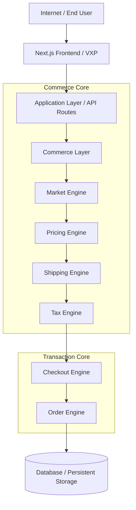
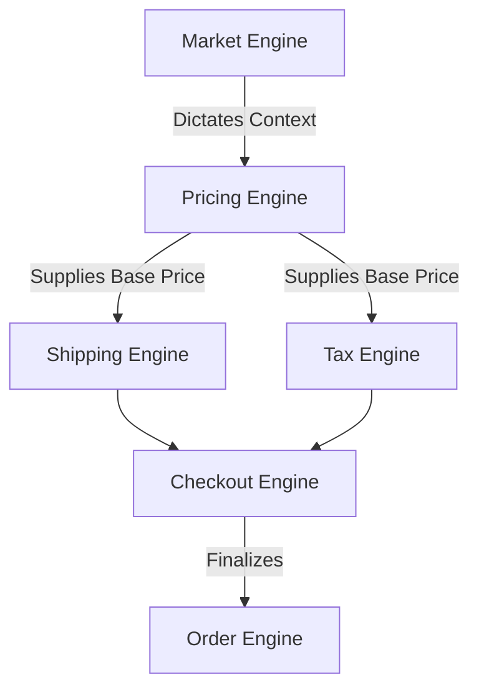
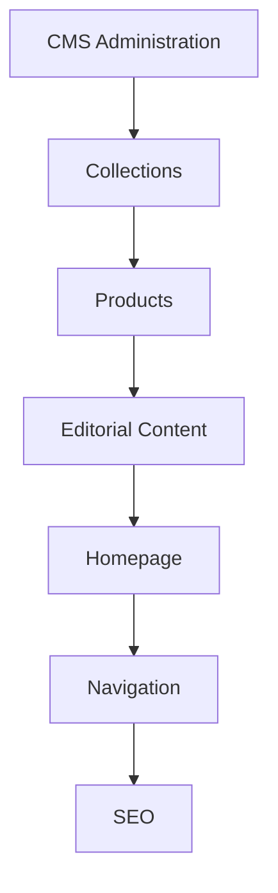
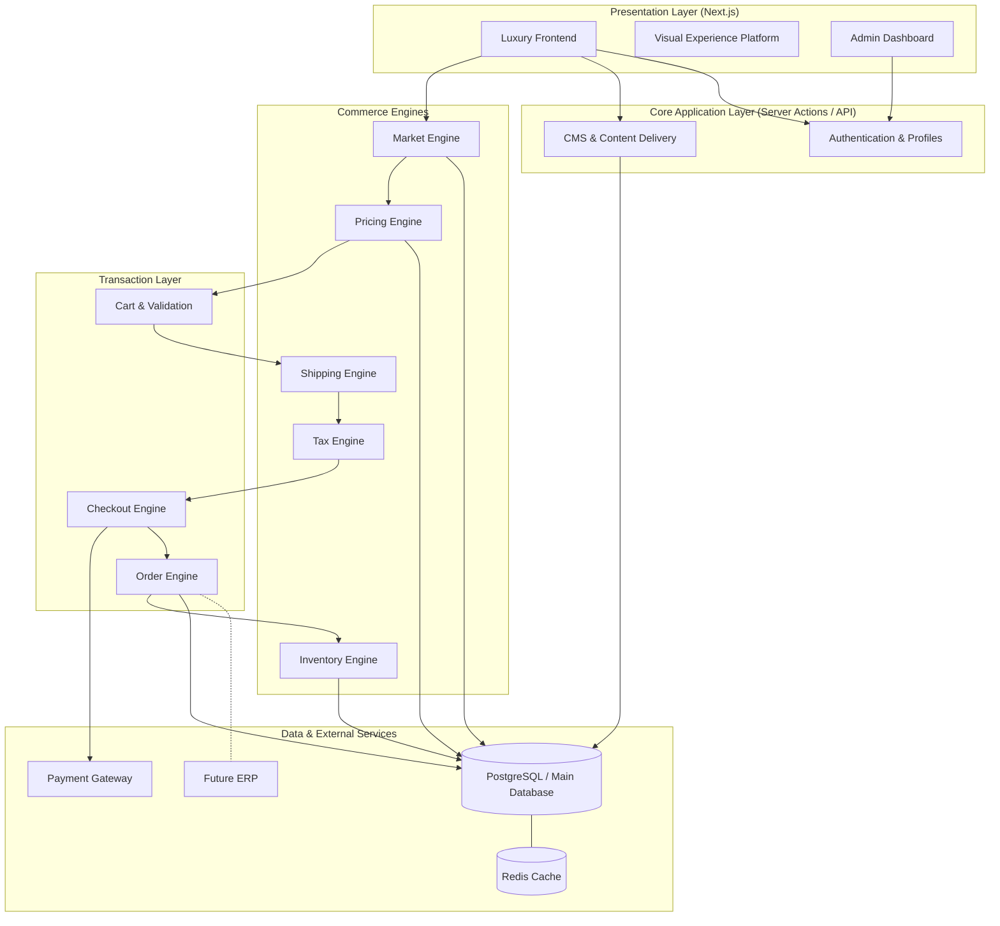

# Tezhhomayaa System Architecture

This document serves as the master architectural blueprint and single entry point for the entire Tezhhomayaa Commerce Platform. It is intended for every future developer, architect, AI agent, and technical stakeholder.

> [!IMPORTANT]
> This is the definitive technical blueprint for the project. All future modules, integrations, and architectural decisions must align with the principles and boundaries established in this document.

---

## 1. Vision

Tezhhomayaa is not simply an ecommerce website; it is a modular, luxury commerce platform designed for global scale. The architecture is built to support:

- Global Markets with strict localization and pricing strategies
- Uncompromising Luxury Commerce UX (motion, aesthetics, performance)
- Headless, deeply integrated Content Management System (CMS)
- Independent International Pricing Engines
- Enterprise-grade Inventory Management
- Dynamic Shipping & Taxation Engines
- Comprehensive Customer Accounts & VIP Tiers
- Future integrations including Mobile Apps, ERP systems, and AI-driven concierge features

---

## 2. Platform Philosophy

The Tezhhomayaa platform is governed by the following core principles:

- **Single Source of Truth:** Business logic is never duplicated. Subsystems own their respective data exclusively.
- **Server First:** Sensitive operations, business logic, and security validation occur exclusively on the server.
- **Modular & Composable:** Subsystems operate as independent modules (e.g., Pricing Engine is unaware of the CMS).
- **Enterprise Grade:** Built for scale, security, auditability, and rigor.
- **AI Friendly:** Architected to expose clear boundaries, well-typed interfaces, and strict rules for autonomous AI agents.
- **Luxury First:** Performance and stability directly influence brand perception. 
- **Performance First:** Edge-caching, Server-Side Rendering (SSR), and minimal client payload.
- **Scalable:** Designed to handle thousands of SKUs across dozens of markets without performance degradation.

---

## 3. High-Level Architecture

The platform follows a layered architectural pattern, moving from presentation to core business logic.

---

## 4. System Modules

### Design System & Motion Engine
- **Purpose:** Manages the visual language, typography (Cormorant, Inter), and Framer Motion animations.
- **Responsibilities:** UI components, entrance animations, layout primitives.
- **Status:** Active.

### CMS Architecture
- **Purpose:** Manages collections, journals, homepage layout, and product metadata.
- **Responsibilities:** Supplying rich content.
- **Dependencies:** Media Service.

### Market Engine & Selector
- **Purpose:** Identifies and assigns the correct geographic/commercial context to the user.
- **Responsibilities:** Resolving country, currency, locale, and language.
- **Produces:** Market Context.

### Pricing Engine
- **Purpose:** Decouples pricing from simple FX conversions.
- **Responsibilities:** Resolving the absolute base price for a given product + market + customer.
- **Consumes:** Market Context, Customer Context.
- **Produces:** Resolved Base Price.

### Tax Engine
- **Purpose:** Calculates regional duties and taxes.
- **Dependencies:** Market Engine, Pricing Engine.

### Shipping Engine
- **Purpose:** Calculates fulfillment costs and logic.
- **Dependencies:** Market Engine, Cart weight/dimensions.

### Checkout & Order Engines
- **Purpose:** Manages secure payment intent creation and final order state.
- **Responsibilities:** Cart validation, payment gateway integration, order creation.

### Supporting Modules (Active & Future)
- **Active:** Customer Account, Admin Dashboard, Media Service.
- **Future:** Notification Engine, Analytics, Enterprise Inventory Engine, ERP Integration, AI Concierge.

---

## 5. Module Dependency Map

Dependencies flow downwards. Modules never depend on modules below them, preventing circular dependencies.

**Why this order?**
You cannot price a product without knowing the **Market**. You cannot calculate **Taxes** without knowing the **Price**. You cannot determine **Shipping** without knowing the **Market** and the items. You cannot enter **Checkout** without aggregating all the above.

---

## 6. Data Flow

The complete customer journey traces through the architecture sequentially:

---

## 7. CMS Flow

The CMS influences the presentation layer without altering core commerce logic.

---

## 8. Backend Services

- **Authentication Service:** Manages JWTs, sessions, and roles (Customer vs. Admin).
- **Market Service:** Exposes the active market via cookies, geolocation, or user preference.
- **Pricing Service:** Queries database Price Lists to resolve final base prices.
- **Tax & Shipping Services:** Integrates with localized profiles to calculate surcharges.
- **Order Service:** Validates carts, communicates with Stripe/Payment processors, and commits orders to the database.
- **Media & Search Services:** Manages asset optimization (Cloudinary) and fast product lookups (Algolia/Typesense).

---

## 9. Database Philosophy

The persistent storage relies on relational principles, ensuring ACID compliance for transactions.
- **Products:** Core attributes, SKUs, inventory counts.
- **Markets:** Region definitions, currency bindings.
- **Price Lists:** `Product ID + Price List ID -> Decimal Price`.
- **Orders:** Immutable snapshots of transactions, tracking line items, resolved taxes, and shipping.
- **Customers:** Profiles, addresses, VIP tiers.
- **Collections & Media:** Metadata and CDN links.

> [!NOTE]
> Database schemas will remain adaptable for future ERP synchronization, ensuring no direct writes bypass the internal Services.

---

## 10. API Philosophy

- **Server Actions:** Primarily used within Next.js for secure, form-based mutations (e.g., Add to Cart, Select Market) without exposing API routes.
- **REST / Internal APIs:** Used for Service-to-Service communication.
- **SSR & Caching:** Heavy reliance on React Server Components (RSC) and Next.js aggressive caching for catalog reads.
- **Future GraphQL:** Optional future layer if frontend aggregation needs become highly complex across multiple microservices.

---

## 11. Security Architecture

- **Authentication:** Secure HttpOnly cookies for session management.
- **Authorization:** Strict Role-Based Access Control (RBAC) preventing customers from accessing `/admin` routes.
- **Pricing Security:** The frontend NEVER calculates or dictates the final price. All prices are verified server-side during checkout.
- **Rate Limiting:** Implemented on all mutations and auth routes to prevent brute-force attacks.
- **Secrets:** Environment variables strictly separated between build-time and runtime.
- **Audit Logs:** Immutable tracking for Admin changes (e.g., Price List modifications).

---

## 12. Performance Architecture

- **Edge Rendering:** Middleware executes at the edge for instant Market resolution.
- **SSR:** Product pages are pre-rendered or server-side rendered to ensure pristine SEO and instant First Contentful Paint (FCP).
- **Caching:** Catalog data is cached heavily; cache is invalidated via webhooks when CMS updates occur.
- **Image Optimization:** Automated Next/Image optimization serving AVIF/WEBP.
- **Code Splitting & Lazy Loading:** Ensuring JavaScript payloads are minimized.

---

## 13. AI Architecture

AI Agents developing or interacting with this platform must obey architectural boundaries.
- **Never bypass Engines:** AI agents creating new UI (e.g., a "Quick Buy" widget) must call the Pricing Engine, Market Engine, etc., rather than hardcoding logic.
- **Read-Only Context:** AI systems (like chatbots) should consume internal APIs for stock/pricing rather than accessing the database directly.

---

## 14. Future Roadmap

| Phase | Focus Areas |
| :--- | :--- |
| **Current** | Brand Language, Motion Engine, CMS Architecture, Market Engine, Market Selector, Pricing Engine |
| **Next** | Shipping Engine, Tax Engine, Checkout, Orders, Customer Dashboard |
| **Future** | Admin UI, ERP Integration, Mobile Apps (React Native), AI Commerce Features |

---

## 15. Documentation Index

The following specifications govern individual subsystems:

| Document | Description |
| :--- | :--- |
| **PROJECT_MASTER.md** | Overall Vision and Project Instructions |
| **BRAND_GUIDELINES.md** | Luxury Design Language & Typography |
| **CMS_ARCHITECTURE.md** | Content Management System Blueprint |
| **MARKET_ENGINE.md** | Global Markets & Localization Logic |
| **MARKET_SELECTOR.md** | Market UX and Micro-interactions |
| **PRICING_ENGINE.md** | Price Lists and Resolution Strategy |
| **SYSTEM_ARCHITECTURE.md** | This Master Blueprint |

---

## 16. AI Development Rules

> [!CAUTION]
> **Mandatory rules for all AI Agents and Developers:**
> 1. Never duplicate business logic.
> 2. Always consume system modules (Engines) for data.
> 3. Never hardcode prices, currencies, or market data.
> 4. Never bypass the Market Engine when serving content.
> 5. Never bypass the Pricing Engine when displaying a cost.
> 6. Never calculate taxes or shipping in frontend components.
> 7. Always read architecture documentation before implementing features.

---

## 17. Technical Principles

- **Loose Coupling:** Subsystems operate independently.
- **High Cohesion:** Related logic (e.g., all tax logic) belongs in a single engine.
- **Single Responsibility:** A module does one thing perfectly.
- **Dependency Inversion:** Depend on interfaces/services, not concrete implementations.
- **Scalable Architecture:** Capable of horizontally scaling the frontend and database.
- **Future Proof Design:** Avoid technical debt by strictly adhering to the module dependency map.

---

## 18. Final Architecture Diagram

This master diagram maps the entirety of the Tezhhomayaa platform's technical execution.

