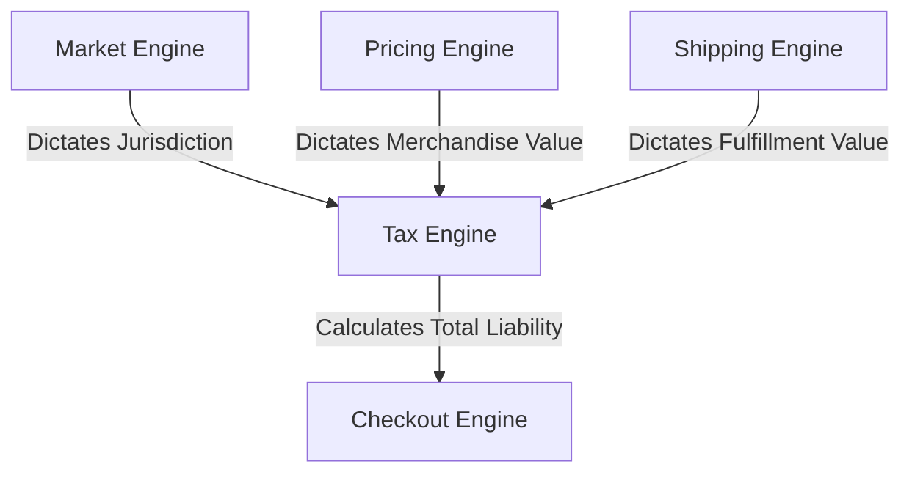
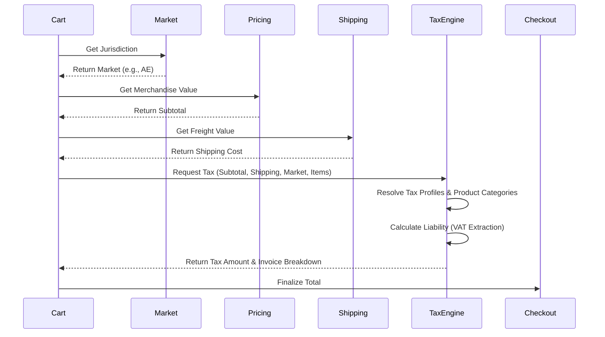

# Tezhhomayaa Enterprise Tax & Compliance Engine

This document serves as the permanent architecture and engineering guide for the Tezhhomayaa Enterprise Tax & Compliance Engine. It establishes the technical framework required to govern global tax logic, ensuring absolute compliance across all operational jurisdictions.

> [!IMPORTANT]
> The Tax Engine is the singular source of truth for all taxation logic, including VAT, GST, Sales Tax, Product Tax Categories, and Invoice calculations. It operates independently of the Market, Pricing, and Shipping Engines.

---

## 1. Purpose

The Tax Engine exists as a dedicated subsystem because taxation logic is distinct from commercial strategy (Pricing) and fulfillment logistics (Shipping). 

The Tax Engine definitively determines:
- The Applicable **Tax Profile** based on the Market.
- The **Product Tax Category** (e.g., standard fashion vs. services).
- The legal **Tax Rate** (percentage).
- The exact **Tax Amount** applied to line items.
- The detailed **Invoice Tax Breakdown** required for legal compliance.
- Essential **Compliance Metadata** for reporting.

> [!CAUTION]
> The Tax Engine **never** calculates merchandise pricing or shipping costs. It strictly consumes those values to apply accurate, jurisdiction-specific taxation.

---

## 2. Tax Philosophy

For Tezhhomayaa, luxury means removing friction. However, global taxation demands strict compliance.

The platform must provide tax calculations that are:
- **Accurate:** Exact to the required decimal precision of the jurisdiction.
- **Transparent:** Clearly communicated to the customer without hidden surprises.
- **Market-aware:** Distinguishing between inclusive (VAT) and exclusive (US Sales Tax) systems automatically.
- **Legally Compliant:** Adhering strictly to regional finance laws (e.g., India GST, GCC VAT).
- **Auditable:** Leaving immutable trails for future ERP and financial reconciliation.

Taxes are determined by law, not commercial pricing decisions.

---

## 3. Architecture Overview

The Tax Engine sits at the very end of the pre-checkout funnel, aggregating the outputs of the previous engines to calculate the final transaction liability.

- **Market Engine:** Sets the jurisdiction (e.g., UAE).
- **Pricing Engine:** Sets the base merchandise value.
- **Shipping Engine:** Sets the freight value (which may be taxed differently).
- **Tax Engine:** Evaluates the aggregate values against regional laws.
- **Checkout Engine:** Finalizes the payment intent.

---

## 4. Tax Profiles

The core data model is the **Tax Profile**, governing the specific tax regime for a region.

A Tax Profile contains:
- `taxProfileCode`: Unique identifier (e.g., `TAX_IN_GST_18`).
- `marketCode`: The jurisdiction (e.g., `IN`).
- `taxType`: The methodology (e.g., `GST`, `VAT`, `SALES_TAX`).
- `taxRate`: The decimal percentage (e.g., `0.18` for 18%).
- `status`: Active, Draft, Archived.
- `priority`: Rank for resolving conflicting or temporary regimes.
- `effectiveDate`: Legal start date of the tax rate.
- `expiryDate`: Optional sunset date for temporal tax changes.
- `isDefault`: Boolean fallback indicator.

---

## 5. Product Tax Categories

Not all luxury goods are taxed equally. The Engine supports **Product Tax Categories** to differentiate rule applications.

Examples of future categories:
- **Fashion (Default):** Standard apparel taxation.
- **Accessories / Jewelry:** May carry luxury surcharges in certain markets.
- **Gift Cards:** Typically zero-rated until redemption.
- **Services:** Tailoring or styling fees, which may attract different tax codes.
- **Digital Products:** Future NFTs or digital passes subject to distinct VAT/GST digital rules.

The Tax Engine resolves the cross-section of the *Tax Profile* + *Product Tax Category* to find the precise legal rate.

---

## 6. Tax Resolution

The engine evaluates strict legal rules before exposing the final Tax Amount.

**Resolution Flow:**
1. **Market Context:** Identify the customer's jurisdiction (e.g., India).
2. **Product Category:** Check the SKU metadata (e.g., Fashion).
3. **Tax Profile:** Retrieve the active profile for `IN` + `Fashion`.
4. **Applicable Rule:** Apply the mathematical formula (e.g., Inclusive vs Exclusive extraction).
5. **Tax Amount:** Return the finalized scalar value representing the liability.

---

## 7. Invoice Architecture

The Engine structures its output to support legally binding invoice generation.

**Invoice Breakdown Support:**
- **GST:** Splitting into CGST + SGST (India) based on intra/inter-state shipping origin.
- **VAT:** Extracting the inclusive VAT from the total for European/GCC invoices.
- **Sales Tax:** Appending exclusive zip-code-level surcharges for North America.

Future architecture will support multi-line invoice breakdowns, ensuring every single SKU displays its distinct tax contribution, complying with enterprise ERP standards.

---

## 8. Compliance

The Tax Engine is built to satisfy international audits.

Future compliance support:
- **GST (India, Australia, Singapore):** Explicit tax invoicing and HSN/SAC code tracking.
- **VAT (Europe, UAE, KSA):** TRN (Tax Registration Number) injections into checkout and business-to-business (B2B) zero-rating rules.
- **Sales Tax (USA):** Future integration hooks for services like Avalara or TaxJar for county/city-level exactness.
- **Audit Logs:** Immutable timestamps whenever a Tax Profile's `taxRate` is altered by an administrator.

---

## 9. Checkout Integration

The Checkout system acts purely as a consumer of the Tax Engine.
- Checkout **never** calculates taxes using raw multiplication (`price * 0.18`).
- Checkout always queries the Tax Engine API with the verified Cart and Shipping output.
- The Tax Engine returns the locked `taxAmount` and breakdown.
- Checkout sums `Subtotal + Shipping + Tax` to create the ultimate Payment Intent.

---

## 10. CMS Integration

Future Admin interfaces will manage compliance through a dedicated configuration tree:

**Admin Flow:** `Tax Dashboard -> Markets -> Tax Profiles -> Product Tax Categories -> Compliance Rules`

This interface allows finance teams to adapt to global tax law changes (e.g., a VAT increase from 5% to 15% in the GCC) without developer deployment.

---

## 11. API Flow

---

## 12. Security

- **Server-Side Calculations:** Taxes are calculated exclusively on secure backend runtimes.
- **No Frontend Logic:** The UI must never contain logic like `if (country === 'US') addTax()`. It must passively render the Tax API response.
- **Validation:** Address verification occurs before hitting the Tax Engine to ensure the correct jurisdiction is applied.
- **Auditability:** Finance teams have complete traceability over which `TaxProfile` was applied to any historical `Order`.

---

## 13. Performance

- **Fast Resolution:** In-memory lookups for standard VAT/GST profiles.
- **SSR Compatibility:** Pre-calculating inclusive tax breakdowns (e.g., "Includes 5% VAT") directly on product pages via Next.js Server Components.
- **Caching:** Standard Market + Category rate cards are heavily cached via Redis.
- **Scalability:** Built to integrate eventually with heavy third-party compliance APIs (Avalara) via asynchronous worker queues for edge-case resolutions.

---

## 14. Future Roadmap

- **Phase 1:** Architecture & Engine Foundations (Current)
- **Phase 2:** Static Tax Profiles & Broad Rules
- **Phase 3:** Product Tax Categories (Fashion vs Services)
- **Phase 4:** Invoice Breakdown & B2B Tax Overrides
- **Phase 5:** External Compliance Integrations (Avalara/TaxJar)
- **Phase 6:** Automated Financial Reporting & ERP Syncing

---

## 15. AI Development Rules

> [!CAUTION]
> **Mandatory rules for all future AI Agents interacting with this codebase:**
> 1. **NEVER** calculate taxes using math formulas in the UI/frontend.
> 2. **NEVER** bypass the Tax Engine when building Cart/Checkout modules.
> 3. **NEVER** hardcode tax rates (e.g., `const UAE_VAT = 0.05`). Tax rates must be resolved dynamically from the database `TaxProfiles`.
> 4. **ALWAYS** resolve taxes through the API abstraction of the Tax Engine.

---

## 16. Design Principles

- **Single Source of Truth:** All legal compliance and rates live here.
- **Server First:** Sensitive cost calculations are un-tamperable.
- **Market Aware:** Fully contextualized by the Market Engine.
- **Legally Compliant:** Precision and breakdown capabilities prevent financial penalties.
- **Scalable:** Abstract rules prevent code duplication across 195+ jurisdictions.
- **Enterprise Grade:** Heavily typed, extensible, and built for strict auditing.
- **Future Proof:** Designed to accommodate digital products, B2B tax exemptions, and third-party SaaS integrations natively.
